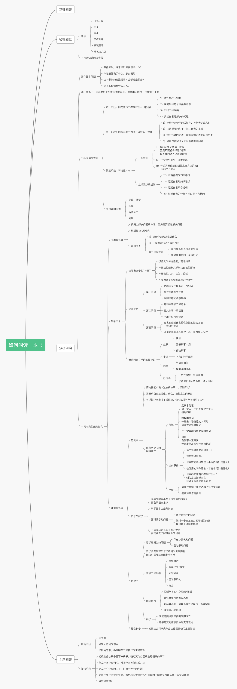

# 如何阅读一本书

本书旨在教导读者如何主动阅读一本书，并尽可能地提升阅读的收益和性价比。

其将阅读分为四个层次：基础阅读、检视阅读、分析阅读、主题阅读，阅读层次收益、难度和对读者主动性的要求逐级递增，并且每个层次的阅读都需要用到其所有下层的阅读。

本书的侧重点有三：

+ 选择最合适的阅读层次
+ 详细介绍分析阅读及其细分
+ 介绍主题阅读

## 总体思维导图

## 架构笔记

### 阅读的层次

+ 阅读的目标是获得资讯/知识以及增进理解，而主动阅读可以更容易达到目标
+ 阅读分为四种不同的层次，每种层次的阅读都会用到其下层的阅读：
  + 基础阅读：只求字面上读懂
  + 检视阅读：在读懂的前提下快速阅读
  + 分析阅读：针对一本书阅读并完全理解/吸取其中的内容
  + 主题阅读：针对某个主题阅读多本书，以求对主题的理解

#### 基础阅读

+ 基础阅读包括四个阶段：
  + 阅读准备阶段：相当于学前班的阶段，也就是对世界常识有一个基础的认知
  + 认字：能认识常用的字/词，相当于小学一~三年级
  + 字汇的增长和运用：具备日常生活中够用的读写能力，相当于小学四~六年级
  + 顺利阅读：能够熟练阅读绝大部分书籍和杂志，相当于初中
+ 虽然接受过义务教育的人基本都掌握基础阅读，但如果书籍的语言不相通，阅读者仍旧需要从基础阅读开始学起，就像不懂英语的人看英文书需要从英语开始学起一样

#### 检视阅读

+ 检视阅读的前提是精通基础阅读
+ 检视阅读分为两种：
  + 略读：选择性阅读，目的是了解这本书是干什么的。主要读的地方有：
    + 书名、序
    + 目录页
    + 索引
    + 出版者介绍
    + 挑几个跟书的主题相关性较强的篇章看（只读其摘要或头尾）
    + 随机阅读几个片段（不要多）
  + 粗浅的阅读：不要停留，在能读懂的情况下快速从头到尾阅读全书
    + 即使遇到模糊的地方也不要死钻进去，力求把书过一遍
+ 略读和粗读的目的为：
  + 大致了解一本书，以决定这本书是否值得进行分析阅读
  + 部分书（娱乐性质的书籍）并不需要分析阅读，那么最多用到粗读就行了

#### 更主动地阅读

+ 主动地阅读需要对书本提出四个基本问题，并在阅读完成之后回答：
  + 整体来说，这本书到底在谈些什么？
    + 也就是找到书中的核心主题
  + 作者细部说了什么，怎么说的？
    + 找到书中的架构，并且找出其中的主要想法、声明、论点
  + 这本书说得有道理吗？是全部有道理，还是部分有道理？
    + 在能回答前两个问题的基础上，对书本进行评论
  + 这本书跟你有什么关系？
    + 书中哪些是想要知道并深入了解的？哪些是自己不关心的？

### 分析阅读

#### 第一阶段：回答这本书在谈些什么

+ 规则一：对书本进行分类
  + 从书名开始获得其分类的线索
    + 也可以从先前的略读中获得，一个道理
  + 区分书本是理论性的还是实用性的
    + 理论性作品还包括历史、科学、哲学三类
    + 想象文学既不属于理论性也不属于实用性
+ 规则二：用简短的句子概括整本书
  + 使用一个单一的句子，或者最多几句话（一小段文字）来叙述整本书的内容
  + 这一步在检视阅读完成之后基本就可以达到了
  + 合理利用书本的摘要完成这一步
+ 规则三：列出书的纲要
  + 将书中重要篇章列举出来，说明它们如何按照顺序组成一个整体的架构
  + 从这一步开始，会形成一个全书的骨架
    + 可以借助思维导图来可视化地完成这个骨架
+ 规则四：找出作者想要解决的问题
  + 这一步的本质是在发现作者的意图，作者写一本书的目的基本上就是提出并解决问题
    + 也可能只解决部分问题，或者只提出问题而不解决
    + 想象文学例外
  + 如果实在找不到作者的意图，可以尝试如下模板：
    + 理论性问题模板包括：
      + 某件事存在吗？
      + 是什么样的事？
      + 发生的原因是什么？
      + 是在什么样的情况下存在？
      + 为什么会有这件事的存在？
      + 这件事的目的是什么？
      + 造成的影响是什么？
      + 特性及特征是什么？
      + 与其他类似事件，或不相同事件的关联是什么？
      + 这件事是如何进行的？
    + 实用性问题模板包括：
      + 有哪些结果可以选择？
      + 应该采取什么样的手段才能获得某种结果？
      + 要达到某个目的，应该采取哪些行动？以什么顺序？
      + 在这些条件下，什么事是对的，或怎样才会更好，而不是更糟？
      + 在什么样的条件下，这样做会比那样做好一些？

#### 第二阶段：回答这本书详细到底在说什么？

+ 规则五：诠释作者使用的关键字，与作者达成共识
  + 找出书中每个部分的关键字
    + 关键字一般是专门词汇、特殊词汇，或者带有特殊意义的普通词汇
  + 通过关键字与作者达成共识
    + 通过书本的上下文理解关键字的意义
    + 达成共识指的就是在这些关键字上与作者达成一致的理解
+ 规则六：从最重要的句子中抓住作者的主旨
  + 结合规则五找到的关键字，以及每个部分的关键句，来架构作者的主旨
  + 架构出来的主旨一定是要用自己的话复述一遍，而非照搬原文
+ 规则七：找出作者的论述，重新架构论述的前因后果
  + 除了明白作者的主旨，还需要明白作者主旨的理论依据
  + 利用关键字和关键句子的上下文来架构论述
    + 有时候关键字句的上下文本身就是论述
    + 如果没有，就需要自己缕清逻辑架构论述
    + 运用该规则的注意事项：
      + 首先，所有论述都包含一些声明，其中有些是你为什么接受该作者这个论述的理由，顺着理由缕逻辑
      + 其次，区别两种不同的论述：
        + 以一个或多个特殊的事实证明某种共通的概念（归纳）
        + 以连串的通则证明更进一步的共通概念（演绎）
      + 第三，找出作者认为哪些是假设的，哪些是能证实的，哪些是不需要证实的自明之理
        + 注意是作者认为的，而不是你认为的
+ 规则八：确定作者解决了和没解决哪些问题
  + 重新审视规则四种找出的问题，利用前面三个规则的阅读收获来找出：
    + 作者解决了哪些问题？答案是什么？
    + 作者哪些问题是提出来但没解决的？
    + 没解决的问题中，哪些是作者觉得无法解决的？

#### 第三阶段：评论这本书

##### 评论书籍的一般规则

+ 规则九：不要轻易评论
  + 在表达同意/不同意/暂缓评论之前，一定要能肯定地说【我懂了】
  + 只能在你尽过最大努力之后，因为书而不是你自己的理由才能说【我不懂】
+ 规则十：避免争强好胜
  + 如果不同意作者的观点，不要无理辩驳
  + 提出反对意见之后需要尝试化解争议，如果最终证明是自己的问题的话不要为了面子非辩到底
+ 规则十一：尊重知识与个人观点的不同，在作任何批评之前都要找出理论基础
  + 这个规则应该跟规则十一起运用
  + 理想化辩论必须满足以下三种条件：
    + 不要带入情绪
    + 辩论之前事先摊出自己的假设、前提、甚至偏见
    + 避免派别之争，需要站在作者的立场来辩驳

##### 批评观点的特殊规则

当你能满足如下四条规则中至少一条，才足够说【我了解，但我不同意】

+ 规则十二：证明作者知识不足
  + 这里不足的知识必须要被证明与作者的问题有关，并且在获得这些知识之后能够改变问题的结论
+ 规则十三：证明作者知识错误
  + 指出作者论述中用到的哪些知识是错误的，并提供依据
  + 除非纠正这些知识会影响到作者的结论，否则没有必要指出
+ 规则十四：证明作者不合逻辑
  + 这一种批评比较困难，需要完整缕清作者的论述才有可能能提出
  + 一般来说，荒谬有两种形态：
    + 缺乏连贯，也就是理由推不出结论
    + 事情变化前后不一致，也就是自相矛盾
  + 指出荒谬同样需要证据
  + 除非这些荒谬影响到最终结论，否则也没必要指出
+ 规则十五：证明作者的分析与理由是不完整的
  + 如果你无法给自己的批评观点找足理论依据，你就需要无条件同意作者的论点
  + 不完整包括：
    + 没有解决一开始提出的所有问题
    + 没善用身边能用到的资料
    + 没有进一步用尽其推论继续推导至结束（思考不足）
  + 严格来说这条规则不能用于进行批评，作者受限于其写作背景很难做到完整分析

#### 辅助阅读

+ 可以用于辅助阅读的包括：
  + 导读、摘要等其他个体对本书的理解结果
  + 工具书、百科全书、网络等能获取跟书本问题相关资料的
    + 工具书帮助理解文字，百科全书帮助理解事件
+ 不要一开始就用上辅助阅读，这样自己的分析阅读结果很容易被辅助阅读（尤其是导读、摘要）带偏

### 不同读物的读法

`TODO`

### 主题阅读

`TODO`

## 主观笔记

### 主观感想

`TODO`

### 技能取舍

`TODO`