# Gradient Descent（梯度下降）

这里主要讲梯度下降的优化点和数学原理

## Tuning your learning rate

学习率不能太高也不能太低，太高会导致无法到达最低点，太低则会使其收敛速度变慢

### 自动调节学习率

学习率与每一步的步长线性相关，所以随着迭代次数增多，学习率可以越来越小。

有一个简单粗暴的方式让学习率随迭代次数增多而减少（t是迭代次数）：

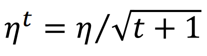

### Adagrad

这是另外一种简单调整学习率的方法。其思想是给上面的已经修正过的学习率再除以目前为止所有偏导数的**root mean square**：

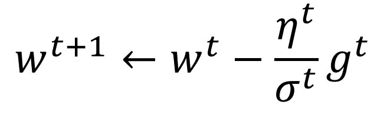

其中：

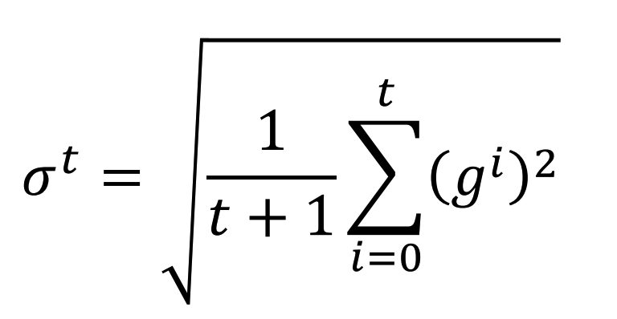

展开之后分子分母的可以消掉，于是变成：

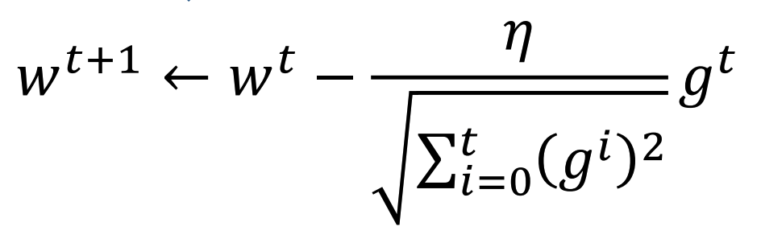

## Stochastic Gradient Descent

这是一种更快的梯度下降。其每次迭代不会计算全部记录，而是随机取一条记录（或者按顺序取）

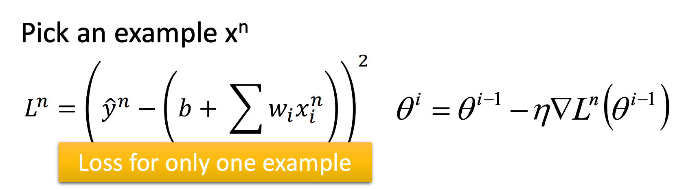

其可以在做到同样的计算量的情况下迭代更多次，并离目标更近：

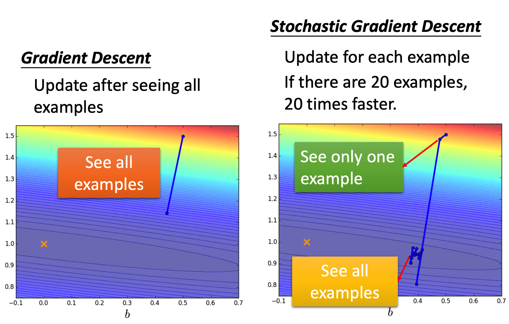

## Feature Scaling

不同特征的数据范围可能会出现较大差异，使得梯度下降会走弯路。

故需要将特征进行标准化：

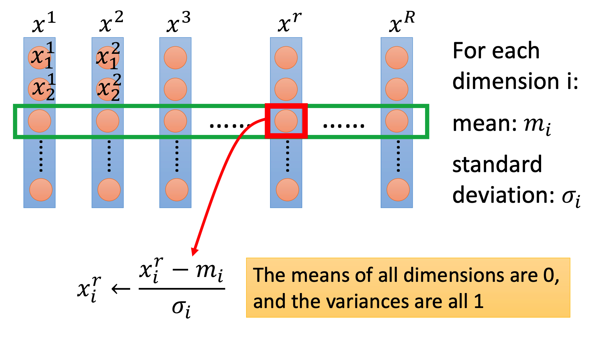

其中是第i个特征的平均值，是第i个特征的标准差

## Theory

这里讲的是梯度下降为什么可以让函数值往极值点收敛。

> 这里有个前置问题是，梯度下降真的能让函数值往极值点收敛吗？
>
> 答案是不一定，当学习率过高时梯度下降不会收敛。

梯度下降的本质是，每次从当前点的一定范围内找到**函数值最小的点**取代当前点：

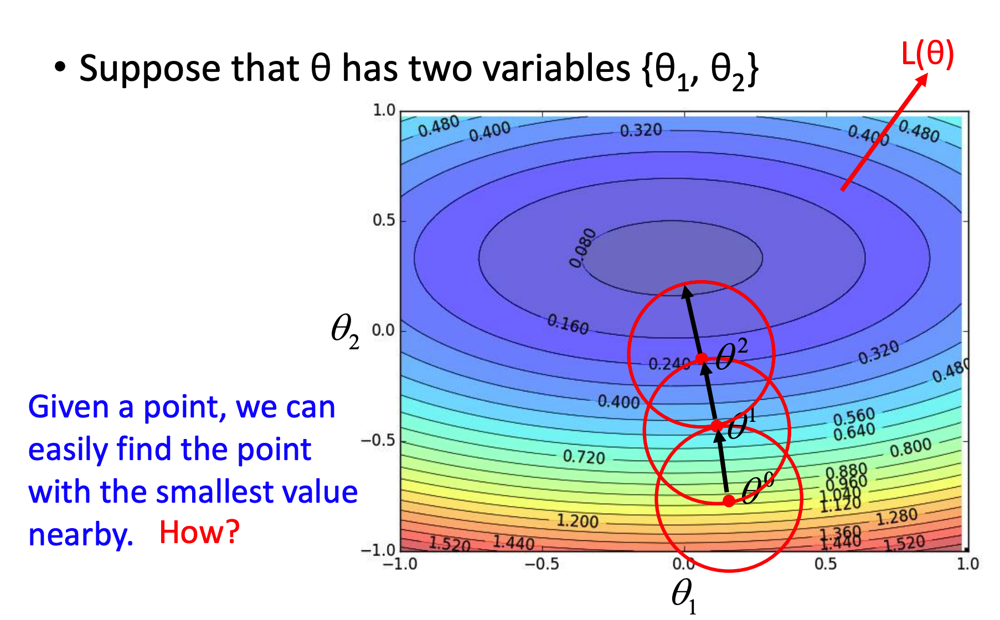

### 回顾Taylor Series

高数学过，任何一个可无限微分的函数都可以进行泰勒展开：

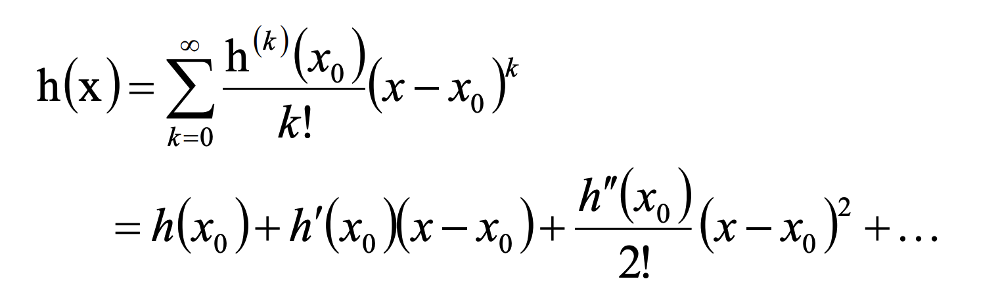

只取前两项，就有：

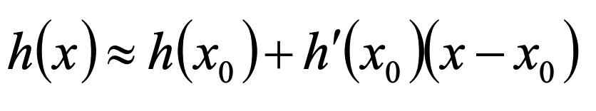

当x离越近，上述约等于越接近h(x)的值。

对于有两个参数的函数，同样可以类推：

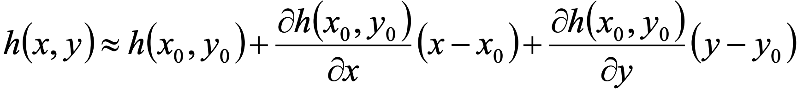

回到问题，问题中假设函数只有两个参数，则我们需要求函数在点的一定范围内的最小值。

通过Taylor Series可以近似得到：

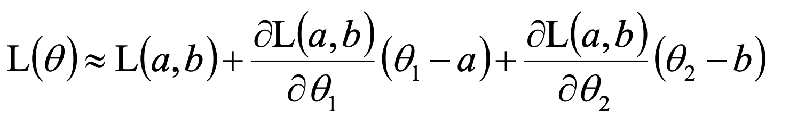

将一些常数用字母代替：

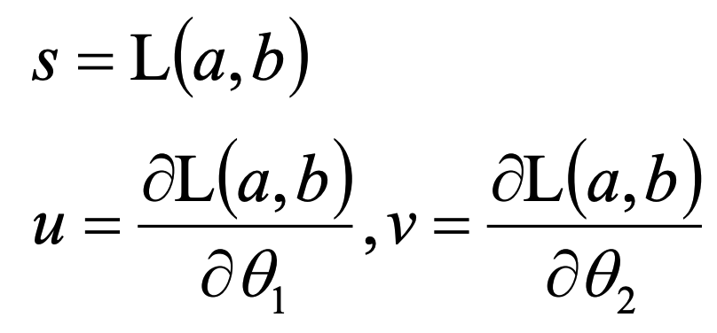

可以得到：

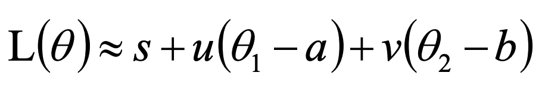

设一定范围为一个半径为d的圆，那么必须在满足的情况下，使最小。

而可以看做是向量<a href="https://www.codecogs.com/eqnedit.php?latex=<u,&space;v>" target="_blank">" title="<u, v>" /></a>和向量<a href="https://www.codecogs.com/eqnedit.php?latex=<(\theta_1-a),(\theta_2-b)>" target="_blank">" title="<(\theta_1-a),(\theta_2-b)>" /></a>的点积，而<a href="https://www.codecogs.com/eqnedit.php?latex=(\theta_1-a)^2&plus;(\theta_2-b)^2{\leq}d^2" target="_blank">则可以看做是向量<a href="https://www.codecogs.com/eqnedit.php?latex=<(\theta_1-a),(\theta_2-b)>" target="_blank">" title="<(\theta_1-a),(\theta_2-b)>" /></a>的长度不能超过d。

于是显然地，当向量<a href="https://www.codecogs.com/eqnedit.php?latex=<(\theta_1-a),(\theta_2-b)>" target="_blank">" title="<(\theta_1-a),(\theta_2-b)>" /></a>和" title="<u, v>" />方向相反即可。于是可以得到：

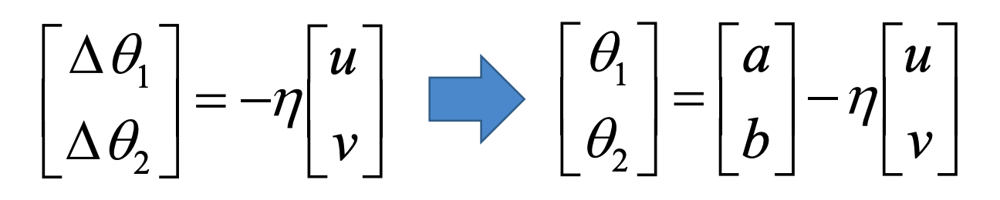

其中学习率用于控制长度不要超过d（也就是范围不要太宽，不然泰勒展开的准确度会下降）。

展开得到：

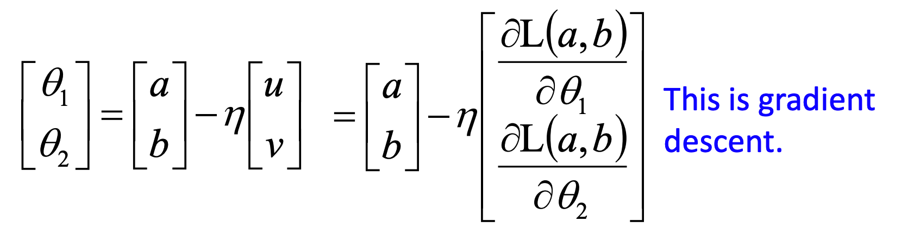

这就是梯度下降的式子了。