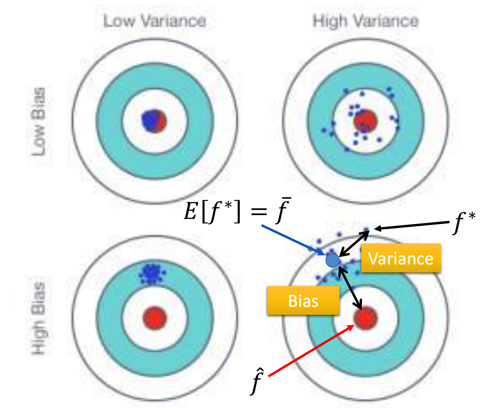
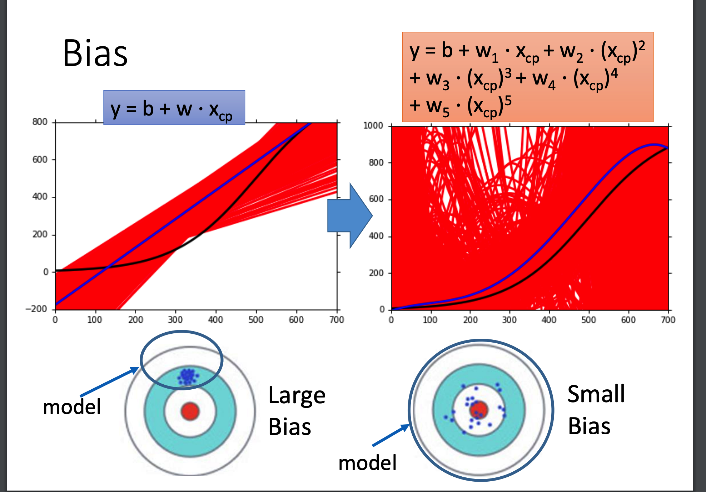
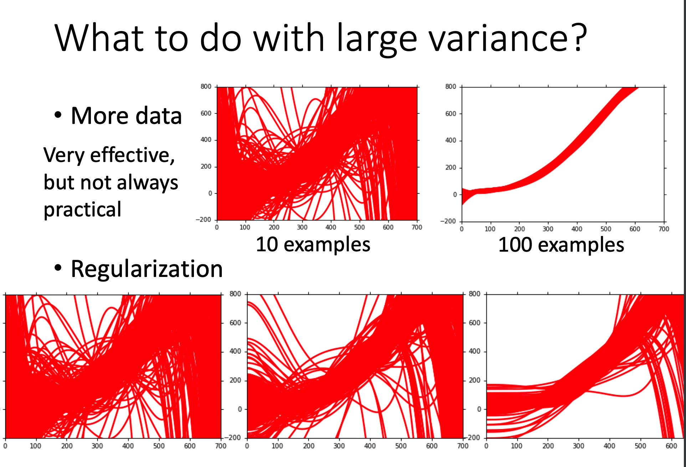
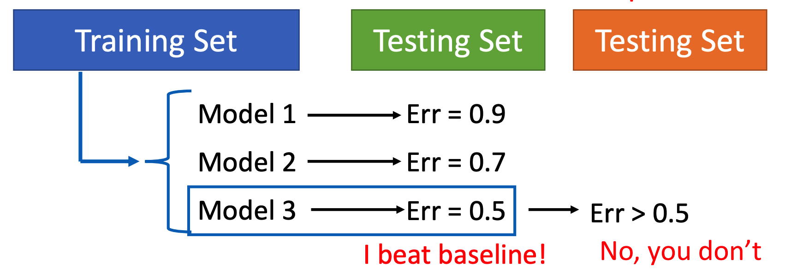
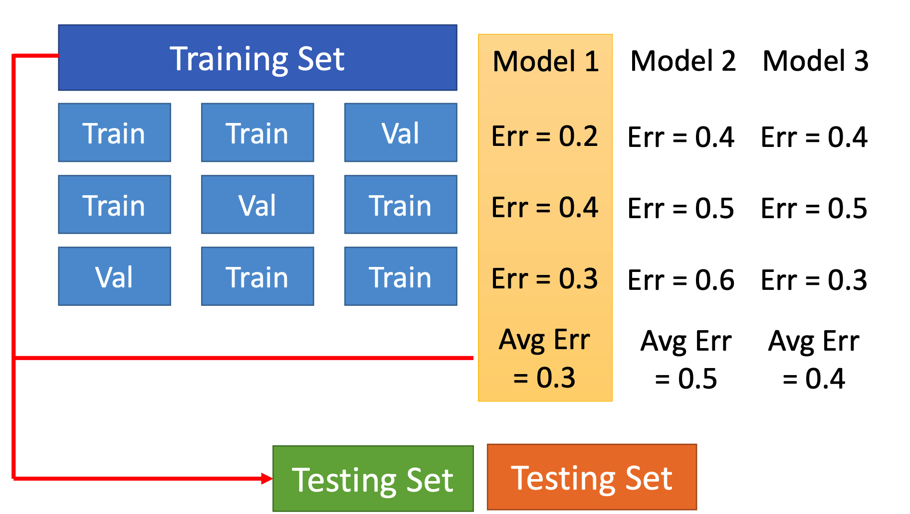

# Basic_Concept（基础概念）

这里主要讲机器学习的基础概念：bias和variance，以及如何做Model Selection

## 误差的来源

现在假设你的Model针对100个不同的数据集训练得到100个不同的结果，并分别计算误差得到一个误差序列。

那么可以看出，误差的来源主要有两种：

+ bias：偏差，当你的100个误差的平均值较大（结果平均值偏离答案）的时候即为bias较大
+ variance：方差，当你的100个误差分布太散（方差较大）的时候即为variance较大

bias较大的情况被称为**欠拟合**，而variance较大的情况被称为**过拟合**。

显然地，一个Model完全有可能既过拟合又欠拟合。

下图可以帮助理解这个概念：

在Linear Regression中，随着幂次增大，模型的variance会越来越大，bias会越来越小：

> 下图中红色曲线是500次训练结果，蓝色曲线是其平均值

一般而言可以通过如下方式判断误差主要来源（也就是bias更大还是variance更大）：

+ 当Model的Training Set Error较大时，说明bias更大
+ 当Model的Training Set Error较小，但Testing Set Error较大时，说明variance更大

## 如何减小误差

分两种情况讨论：

### 如何减小Bias

较大的Bias通常意味着你的Model较为简单，使得符合你的Model的Function较少，从而把目标Function排除在外。

这个时候需要考虑重新设计模型，包括：

+ 增加feature
+ 使用更复杂的Model

### 如何减小Variance

可以使用如下两种方法降低Variance：

+ 增大数据集
  + 这种方法可以在不损耗Bias的情况下降低Variance，但一般需要钱
+ Regularization（正则化）
  + 这种方式本质上是在降低Model的复杂度，所以会伤害到Bias

## Model Selection

如果只使用Training Set训练，Testing Set判断误差，然后选取误差最小的Model提交的话，最终误差往往会大于Test Set的误差：

原因是这样做选择得到的结果事实上将Testing Set本身的bias也考虑了进去，那么结果肯定是不准的。

正确的做法是切分Training Set，使用N-fold Cross Validation（N折交叉检验）得到Error，根据这个Error选出最好的Model，并用Testing Set上的Error作为Model的最终误差。

