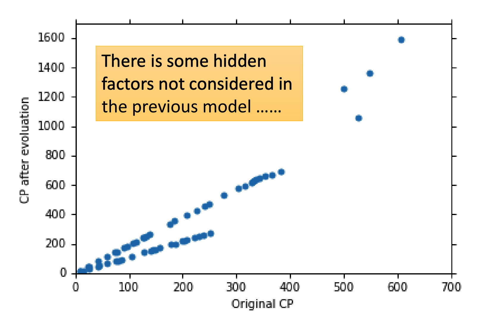

# Regression（回归）

回归所做的事情就是，生成一个函数，使得其根据给定的输入x，可以得到预期的输出y。

## Model（模型）

第一步就是选择Model。课程中介绍的第一个Model是Linear Model（线性模型）：

Model规定了最终生成的函数的格式，同时规定了待训练量

## Goodness of Function

接着，需要一个损失函数L用来评估函数的好坏。

其输入为函数本身，输出为函数的损失（how bad is it）

在Linear Model中，函数的本质是参数w和b，故有

损失函数可以根据自己的需求来定，课程中使用平方误差来规定Linear Model的损失：

显然，损失函数的值越小函数越好。

## Best Function

接着就是找到最佳的函数，使得损失函数最小。

对于Linear Model而言可以直接求解，但课程介绍了更为通用的Gradient Descent

### Gradient Descent（梯度下降）

梯度下降的本质是，针对函数，通过求导迭代逼近最低点。

具体操作方法如下：

1. 随机选择一个点
2. 计算出函数在点上的导数：
3. 
4. 重复迭代至收敛

这里我们定义为Learning Rate（学习率），称之为Gradient（梯度）。

> 注意，这里的w，w0，w1都是一个向量，而不是单一变量或常量

#### 梯度下降的问题

显然，其最终寻找到的是一个极小值而非最小值。

但在Linear Model中不用担心这个问题，因为其损失函数是convex的（凸函数），故其极值点就是最值点。

## Model Selection

我们可以通过多项式的方法给Linear Model加参数，但这个导致的问题就是Overfitting。

于是我们需要根据test data上的数据来选取模型（而不是train data），取test data计算出来的损失函数值最小的Model。

## What are the hidden factor？

如果出现像这样的图，则说明x值不是唯一决定因素，会存在另一个factor在影响着结果：

上面这个图显然可以看出会有多个种类。现在假设这个种类是一个离散变量，那么我们可以这么改写模型：

或者用激活函数来将其改写成一条式子：

其中激活函数为：

其仍为Linear Model，照常训练即可。

## Regularization（正则化）

有时候会在Linear Model上加很多特征（或再加上其多项式特征），使得最终Overfitting。但又因为参数太多没办法一个一个试然后取test data上Loss最小的Model，这个时候就可以用Regularization。

其核心思想是惩罚复杂函数，使Model在不牺牲过多准确性的前提下尽可能平滑和简单。

那么惩罚显然是加在Loss里面的：

其中为正则化参数，其值越高表示惩罚力度越大，最终的Model就会越平滑。

于是调整不同的正则化参数再分别训练，取出test data上Loss最小的函数即可。