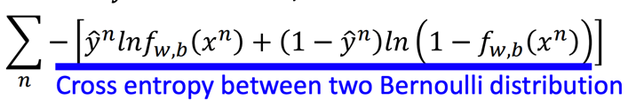
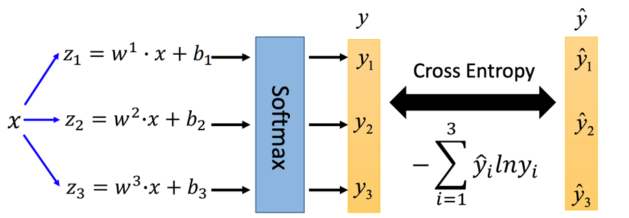

# Logistic Regression

逻辑回归。分类问题的基础做法。

## 步骤

逻辑回归的本质是拟合下面这个函数：

其中：

对于二分类问题而言，训练数据的答案只有0和1两种。

对于分类问题，我们可以使用预测答案的分布和正确答案的分布的Cross Entropy（交叉熵）来作为其损失函数：

其中Cross Entropy的定义如下：

对这个损失函数使用梯度下降的时候，其梯度可以用损失函数对特征的微分表示：

> 之所以损失函数带了负号和自然对数，是因为课件里面的原函数是简单的相减，将其求自然对数的负数才得到交叉熵

于是就会发现，逻辑回归的式子和线性回归的迭代式子一模一样：

## Why not Square Error

对于逻辑回归而言，均方误差的Loss Function过于平缓，使得在上面做梯度下降会很慢甚至走不动：

## Discriminative vs Generative

这次讲了两种类别的模型：识别模型（逻辑回归）和生成模型（概率生成模型）

通常Discrimination的表现会更好，因为Generative是基于假设了数据的分布来进行计算的，但真实数据可能会跟假设的分布有所差距。

但有时候Generative的表现会更好，例如：

+ 训练数据少or脏数据或数据偏差较多：此时Discrimination会受到数据误导训练出一个高bias的模型，而Generative预先假设了数据分布，故其受到数据影响较小
+ 和可以从其他不同的数据中得到

## 多分类问题

对于多分类问题，一般是使用多个线性函数进行softmax得到的函数：

那么其Loss就是结果向量与答案向量的Cross Entropy：

