# Convolutional Neural Network

CNN（卷积神经网络）一般用于多维数据集（二维，或者可以视为多个二维的数据集），常见的应用是对图片数据进行学习。

其目的是通过卷积运算的基础知识来砍掉不必要的神经网络连接，从而在保证训练效果的基础上降低训练开销。

核心思想是，其认为图片上的一部分的特征是不受其位置影响的（例如下例中的鸟嘴）。

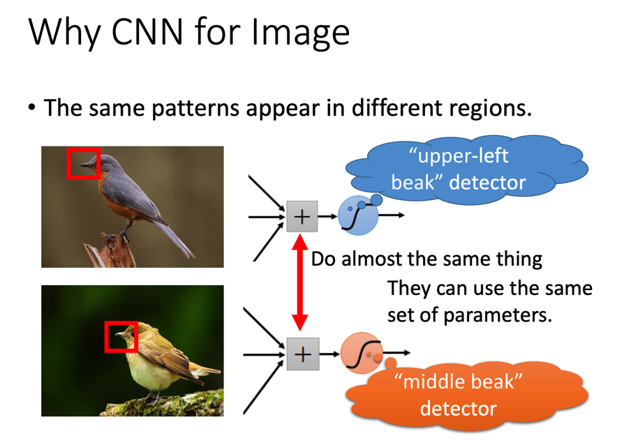

所以CNN认为可以通过一个filter矩阵来扫一遍图片形成满足filter特性的分布（假设filter的目标是找出鸟嘴，那么最后得到的矩阵的值就是对应位置是鸟嘴的可能性）。

原图片通过filter矩阵计算得到结果的步骤如下所示（图中filter只有斜线的数值是1，可以猜测其作用是匹配斜线，而结果矩阵的数值也反映了这个情况）：

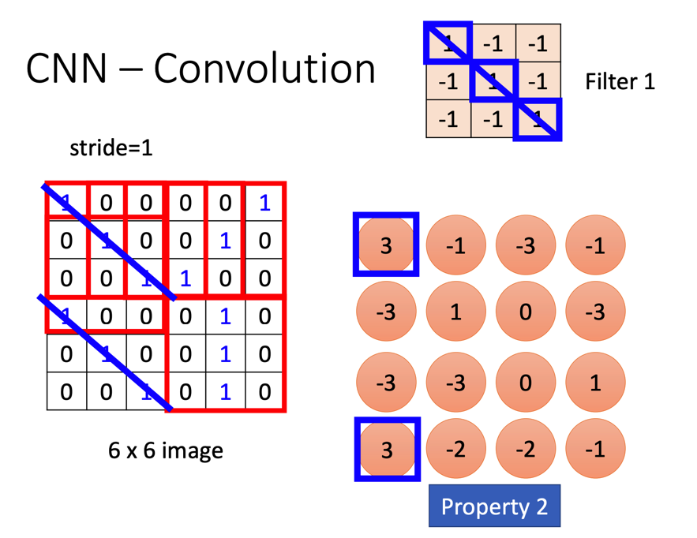

## CNN一般步骤

CNN的步骤如下所示：

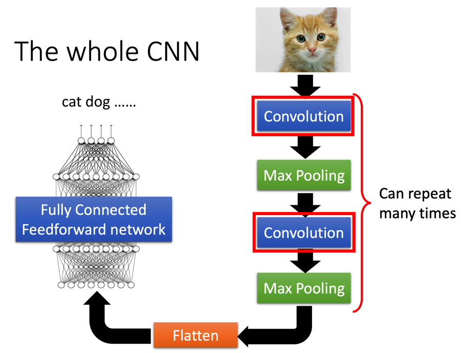

其过程包括：

+ Convolution
+ Max Pooling
+ 重复前两步任意次
+ Flatten
+ 将Flatten的结果扔进一个DNN中，得到最终结果

### Convolution

这一步事实上就是使用多个Filter对原图进行卷积运算。下图以结果的其中一个元素进行举例：

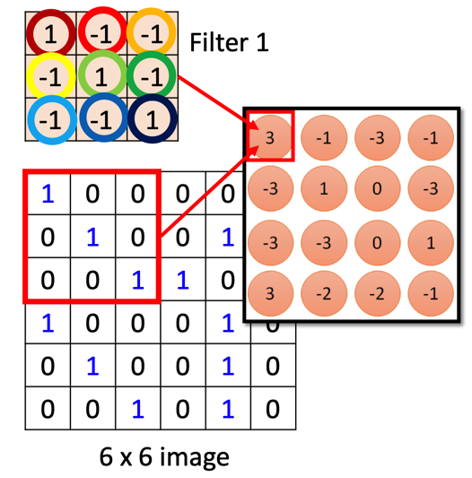

这个元素就是图上两个矩阵的内积结果（矩阵的内积就是矩阵对应位置的元素相乘，然后再加起来得到一个数）。

### Max Pooling

Max Pooling本质就是取最大值，其将filter得到的矩阵进行划分（下图以2x2来举例）：

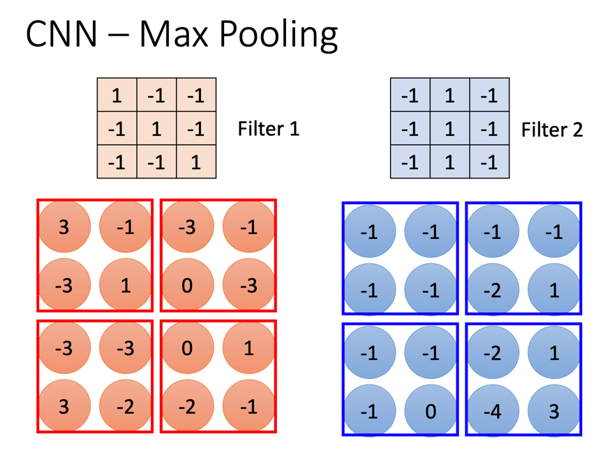

然后求最大值：

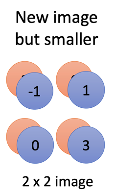

这一步的本质是**降维**，会造成信息损失。

### Flatten

这一步要做的仅仅是展开，将签名训练得到的Tensor展开成为一个Vector，然后喂给DNN得到最终结果。

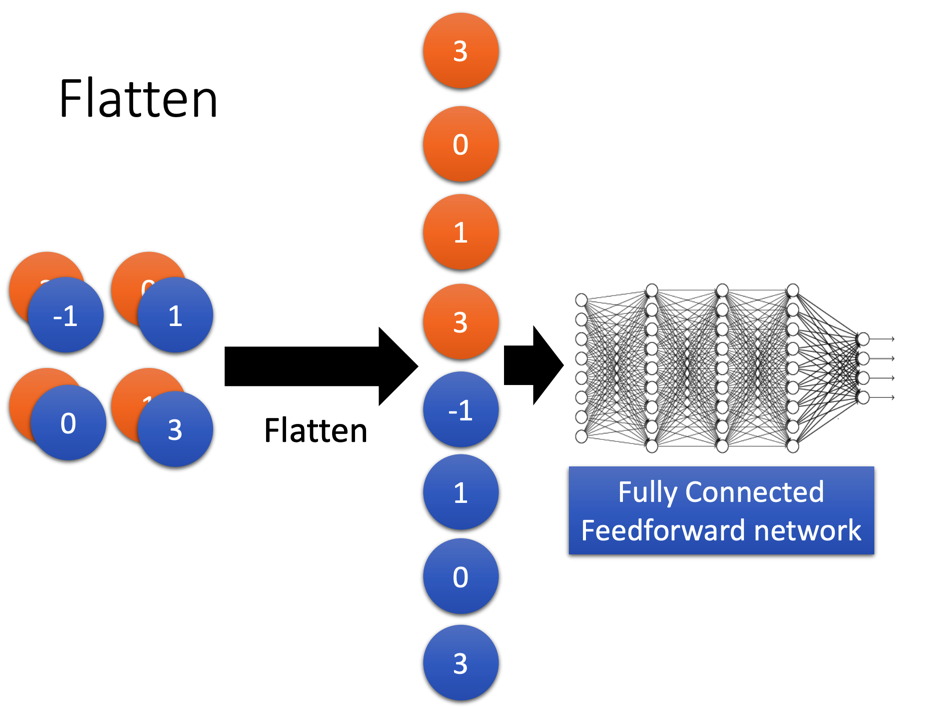

## CNN学到了什么——过程可视化

看起来CNN像是一个黑箱，但其实有办法知道CNN学习得到的模型的中间结果。

我们可以随便选择一个Filter，要知道CNN到它这一步学到了什么（或者说它的功能是什么），可以反过来想，是否存在一张图可以让这个Filter卷积后得到的结果最大（矩阵元素加和最大）。

于是就可以将CNN的参数当做已知数据，目标是让目标Filter的卷积结果最大，然后进行ML来学习得到原图片。

最终得到的图片会是这个样子的：

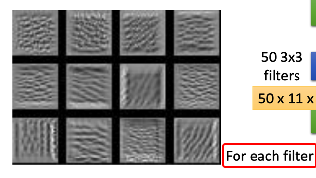

这种图一定程度上可以反映CNN看到了什么。

当然，结果一般往往是杂乱的，所以可以将目标的最大函数做些修改（下例不是对Filter进行还原，而是对最终结果进行还原，原理一样）：

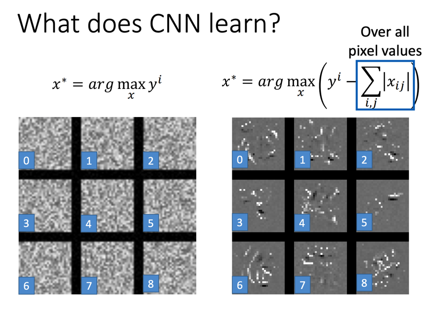

本质上是对图片亮度进行惩罚，让CNN给我们的结果不会看起来那么多亮点。

## CNN的用途

除了图像学习之外，CNN可以运用到其他满足以下条件的学习任务：

+ 二维
+ 具有不受位置影响的部分数据（Convolution的基础）
+ 不受缩放影响（Max Pooling的基础）

例如说：

+ 围棋

  + 可以将键盘看做是二维图片
  + 棋型不受位置影响（在左上角和在中间的吃子都是吃子）
  + 受缩放影响（所以不能用Max Pooling）

  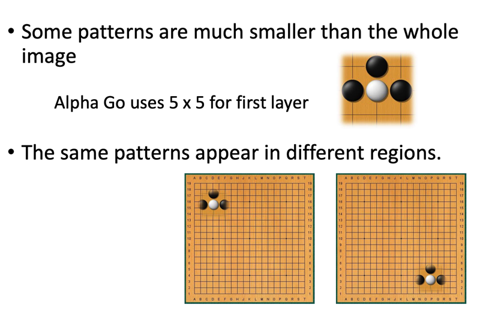

+ 音频

  + 将横轴看做时间，纵轴看做频率，那就是一个二维数据了
  + 说话的声音特征不受频率影响（高音的“Hello”和低音的“Hello”是同个东西）
    + 但注意它受时间影响，所以只能沿着一个维度去卷积
  + 可以小幅缩放（所以要控制好Max Pooling）

  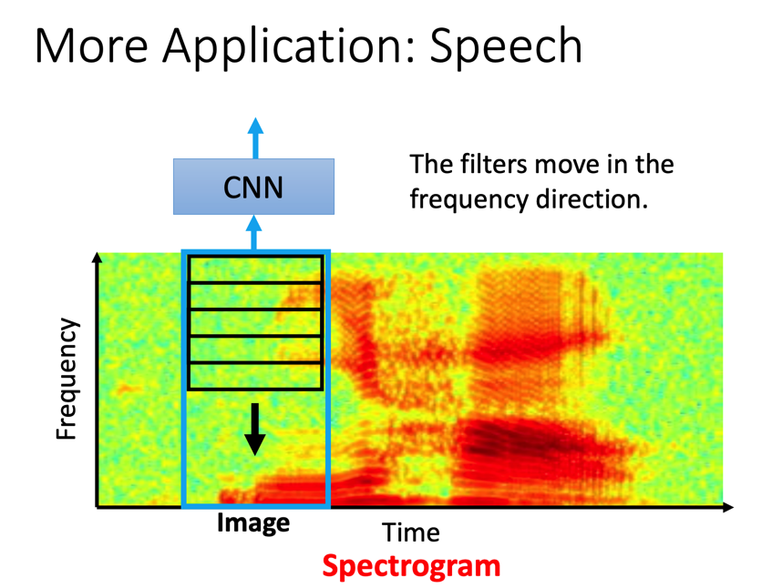

+ 文本

  + 将一个句子的Word Embedding展开，就是二维了
  + 短语意义基本不受其所在位置影响
    + 但另一个维度就不行了，截取Word Embedding的部分没有意义
  + 不能缩放（所以也不能Max Pooling）

  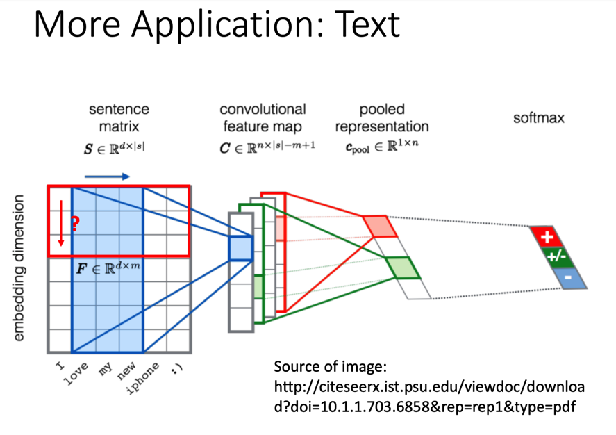

