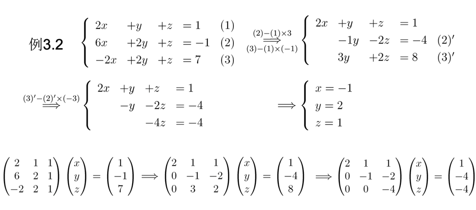

# 第三讲 高斯消元法

高斯消元法的本质就是在按顺序消去系数，使方程组的系数矩阵成为上三角矩阵：

当消元过程中出现：

+ 形如0=x（x不等于0）的式子，说明方程组无解
+ 形如0=0的式子，说明方程组有无穷多解

其他情况下方程组只有唯一解

## 消去矩阵

在高斯消元法中，对系数矩阵的操作有如下两种：

### 交换行

以3x3矩阵交换第一行和第二行为例，此时等同于如下矩阵运算：

<a href="https://www.codecogs.com/eqnedit.php?latex=\begin{pmatrix}&space;0&space;&&space;1&space;&&space;0\\&space;1&space;&&space;0&space;&&space;0\\&space;0&space;&&space;0&space;&&space;1&space;\end{pmatrix}&space;\begin{pmatrix}&space;a_{11}&space;&&space;a_{12}&space;&&space;a_{13}\\&space;a_{21}&space;&&space;a_{22}&space;&&space;a_{23}\\&space;a_{31}&space;&&space;a_{32}&space;&&space;a_{33}&space;\end{pmatrix}&space;=&space;\begin{pmatrix}&space;a_{21}&space;&&space;a_{22}&space;&&space;a_{23}\\&space;a_{11}&space;&&space;a_{12}&space;&&space;a_{13}\\&space;a_{31}&space;&&space;a_{32}&space;&&space;a_{33}&space;\end{pmatrix}" target="_blank"></a>

其中最左边的矩阵定义为，意为单位矩阵交换第一行和第二行的矩阵（置换阵）

### 消去参数

以3x3矩阵中，第二行减去第一行的4倍为例，此时等同于如下矩阵运算：

<a href="https://www.codecogs.com/eqnedit.php?latex=\begin{pmatrix}&space;1&space;&&space;0&space;&&space;0\\&space;-4&space;&&space;1&space;&&space;0\\&space;0&space;&&space;0&space;&&space;1&space;\end{pmatrix}&space;\begin{pmatrix}&space;a_{11}&space;&&space;a_{12}&space;&&space;a_{13}\\&space;a_{21}&space;&&space;a_{22}&space;&&space;a_{23}\\&space;a_{31}&space;&&space;a_{32}&space;&&space;a_{33}&space;\end{pmatrix}&space;=&space;\begin{pmatrix}&space;a_{11}&space;&&space;a_{12}&space;&&space;a_{13}\\&space;a_{21}-4a_{11}&space;&&space;a_{22}-4a_{12}&space;&&space;a_{23}-4a_{13}\\&space;a_{31}&space;&&space;a_{32}&space;&&space;a_{33}&space;\end{pmatrix}" target="_blank"></a>

其中最左边的矩阵定义为，意为单位矩阵中的第二行加上第一行的-4倍的矩阵（消去阵）

### 初等矩阵的使用

使用初等矩阵乘上目标矩阵称为初等行变换，因为其只变化到行

而如果换个方向，使用目标矩阵乘上相同的初等矩阵，则会变化到列，此时的操作也被称为初等列变换

## 增广矩阵

我们可以将如下线性方程组：

定义为如下增广矩阵：

记为

那么高斯消元法本质就是使用若干初等矩阵乘上增广矩阵