# Classification: Probabilistic Generative Model

Probabilistic Generative Model（概率生成模型）是一种用于解决Classification（分类）问题的模型。

## 问题简化

假设现在有一个蓝箱子和一个绿箱子，里面有蓝色球和绿色球。在知道选箱子的概率，和箱内球的分布的情况下就可以通过概率计算求出，当一个球是蓝色时，其是从蓝色箱子里面取出来的概率：

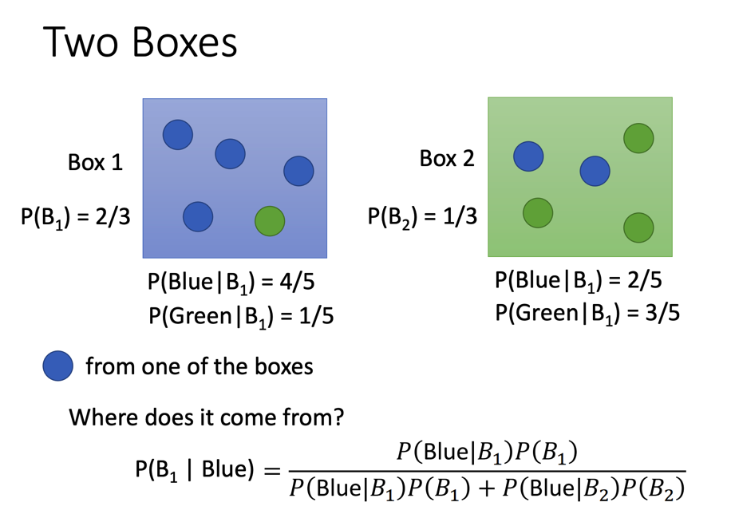

这个问题可以被泛化为，假设有一些被分好类（只有两类）的数据，类别分别是和，那么计算一个新的数据x属于类别的概率就是：

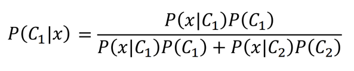

这里有两个量是已知的：和。前者是在以分好类的数据中类别的占比，后者同理。

这里的目标是求剩下两个量，（在类别中出现的概率）和（在类别中出现的概率）。

## Gaussian distribution

这里我们假设数据只有二维，并假设同一类别的数据服从Gaussian distribution（高斯分布）。

> 不一定要用高斯分布，虽然这是最常见的分布

则其概率分布为：

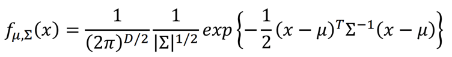

其中D为维度（数据的特征数量），为位置参数（D维向量），为尺度参数（DxD的矩阵）。

在假定知道和的情况下，便可以用来等同于。

于是我们的目标就是，利用已经分类好的数据，计算出两个函数，从而进行二分类。

计算的过程也很显然，将所有的数据套进去函数中，计算其累乘并令其结果最大。

对式子进行微分等于0求原函数极值可以得到：

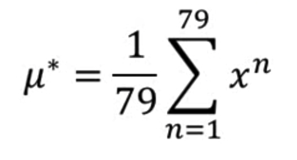

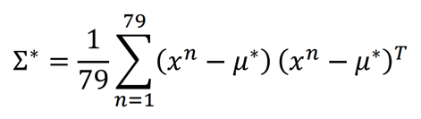

> 79是视频中例子的样本数

## 优化

当维数增大的时候，矩阵中的参数数量会平方增大。而二分类问题会有两个，十分容易过拟合。

从减少参数的角度上思考，我们可以让所有分类函数共用一个：

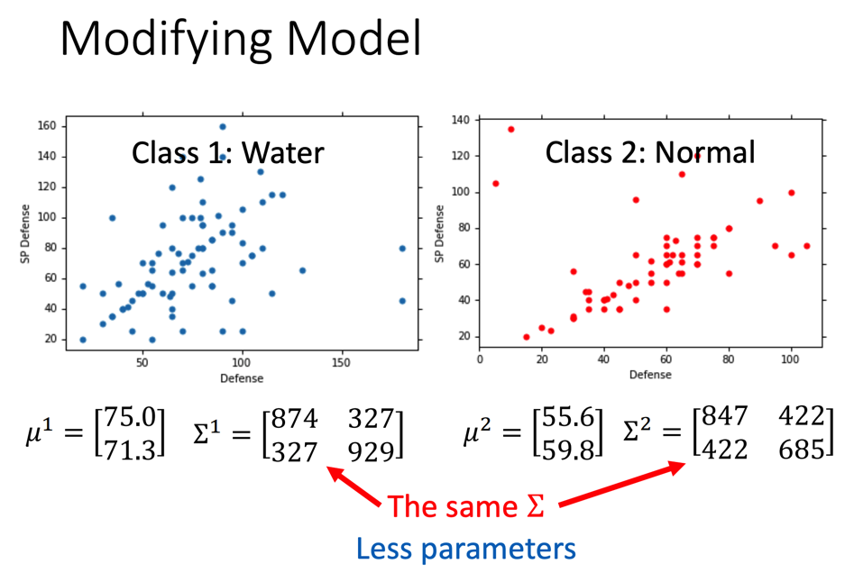

于是的计算就会产生一些变化：

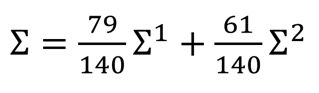

> 140是总数据数，79是函数1对应的分类下数据的数量，61是函数2对应的分类下的数据的数量

## Probability Distribution

你也可以对每个特征单独计算概率分布函数，然后将概率乘起来得到最终概率：

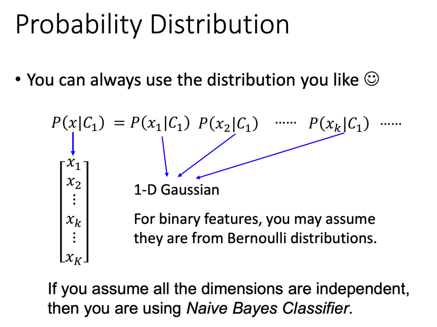

这个行为本质上就是在使用Naive Bayes Classifier（朴素贝叶斯分类器）

## 公式推导

我们可以根据上述结论，将概率分布函数套进求解目标概率的式子中去：

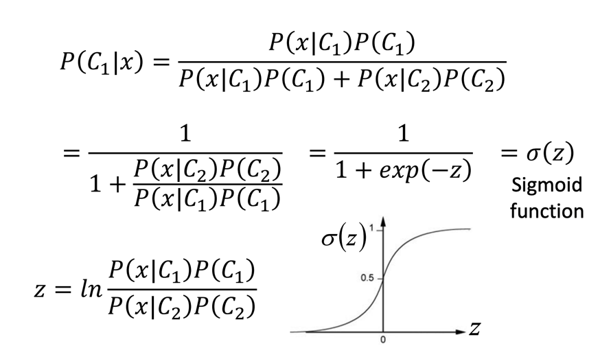

强拆z会得到这一堆东西：

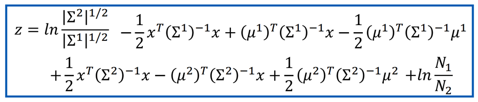

基于前面的优化，我们可以令：

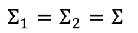

于是可以得到：

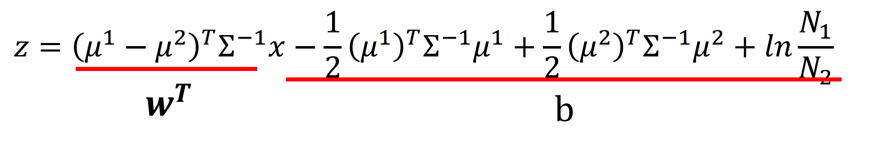

将两个大常数项设为w和b，就可以将求解过程简化到这一步：

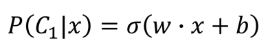

这个就是之后会讲到的Logistic Regression（逻辑回归）的式子。

