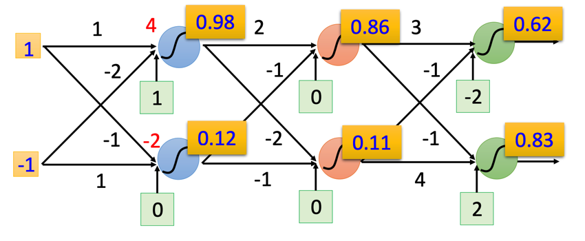
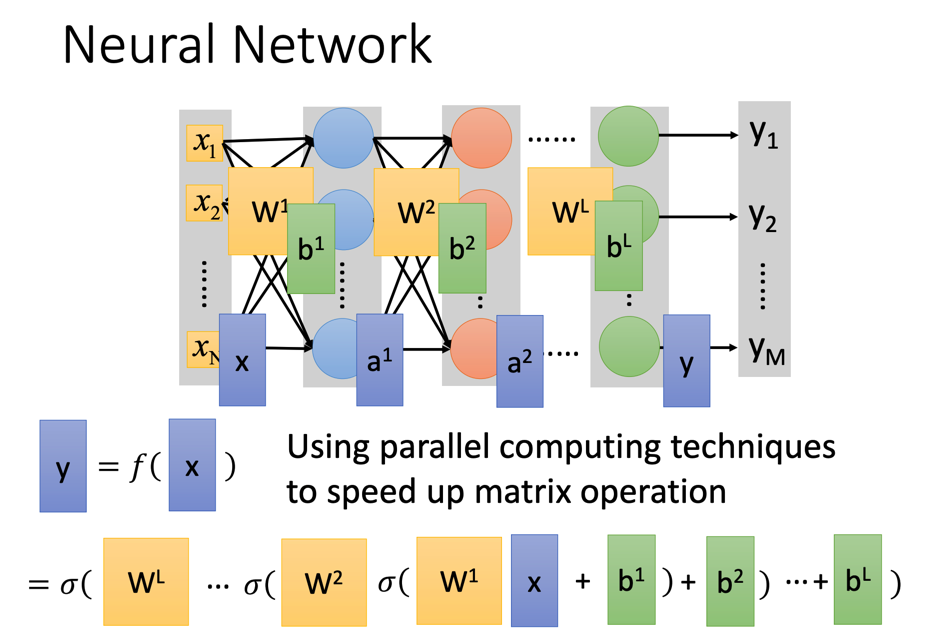

# Deep Learning

深度学习一般泛指所有使用Neural Network（神经网络）的机器学习方式。

神经网络本质上就是多个Logistic Regression接在一起：

> 也不一定是逻辑回归，其本质上是一个线性方程加一个激活函数。如果这个激活函数刚好是sigmoid function的话那就是逻辑回归了。
>
> 其他会用到的激活函数包括之前提到过的softmax

其可以将每一层的参数都当做是一个矩阵，然后连续做函数计算得到最终结果：

相比较于之前的回归模型，神经网络不需要去选择和构造特征，但取而代之的，神经网络需要自己决定网络结构（多少层，每层多少个神经元，神经元之间需不需要全连接，怎么接）

由于其本质就是多个Regression拼起来，故训练方式也是梯度下降。