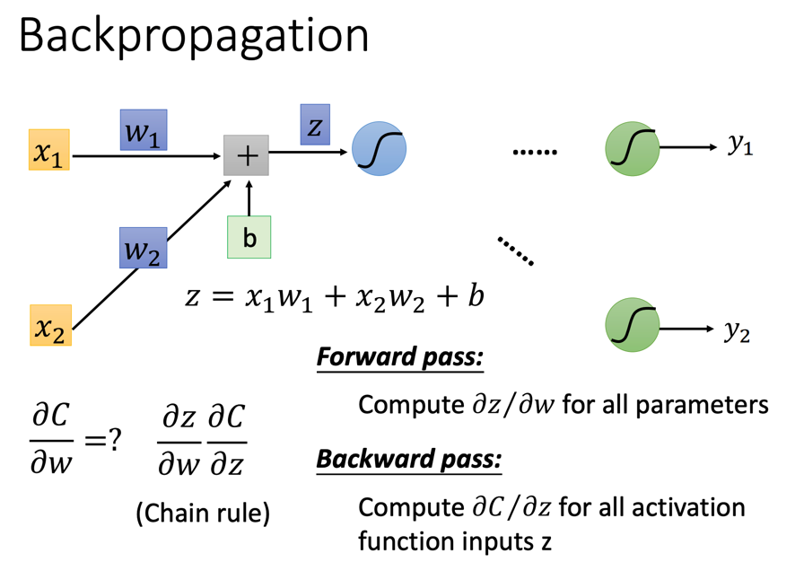
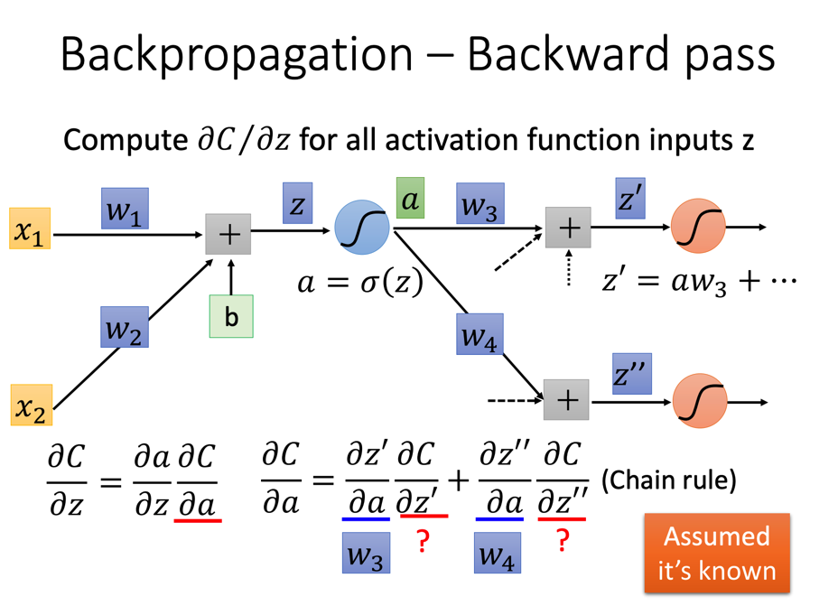
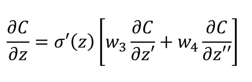
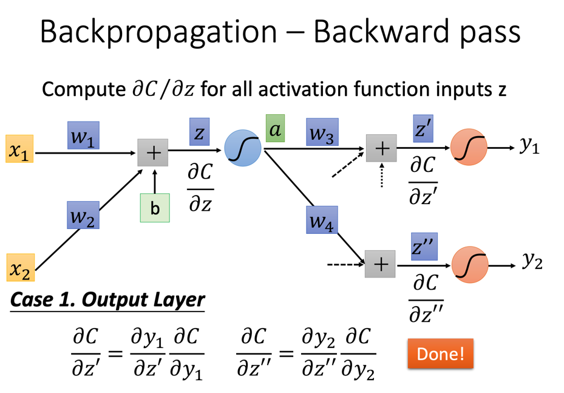

# Backpropagation

Backpropagation（反向传播）是一种用于计算神经网络的梯度下降中每个神经元的微分的算法。

这里只以训练一个数据为例，也就是x和y均为一个向量。

## 拆解微分

先根据链式法则将微分拆解为两部分：

+ 部分：这部分在激活函数之前，直接求导便可以知道其结果为w的**前驱**
  + 例如上图中w1的前驱就是x1，第i层中的w的前驱就是w对应的边的起点的值
  + 故这一步称为Forward pass
+ 部分：这一步称为Backward pass，后面会详细讲解

## Backward pass

对进一步拆解，如下图所示：

+ 部分：由于，故这部分等于
  + 不同的激活函数求导都不同，这里不做展开。但在z已知的情况下，这部分可以理解为一个常数项
+ 部分：这一部分可以根据后面的神经网络进一步拆解：
  + 部分：线性函数求导，直接等于对应的w
  + 部分：这个就是下一层神经网络要计算的了

于是最终便可以写作（以上图为例）：

可以发现只需要反着算就可以算出全部的。

### 终点计算

计算最后一层的的时候，会有些不一样：

同样是拆解成两个量：

+ 部分：由于，故这部分等于
+ 部分：取决于怎么定义Loss（一般是Cross Entropy），这个就只是Loss对预测的y求偏导而已

综上，可以通过反向遍历网络计算出Backward pass，进而最终计算出Loss对每个参数的微分，从而进行梯度下降