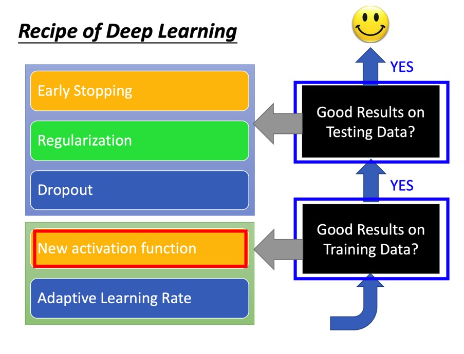
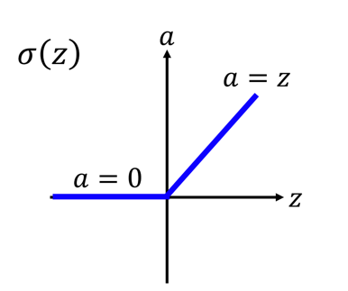
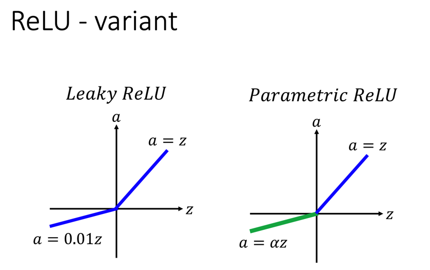
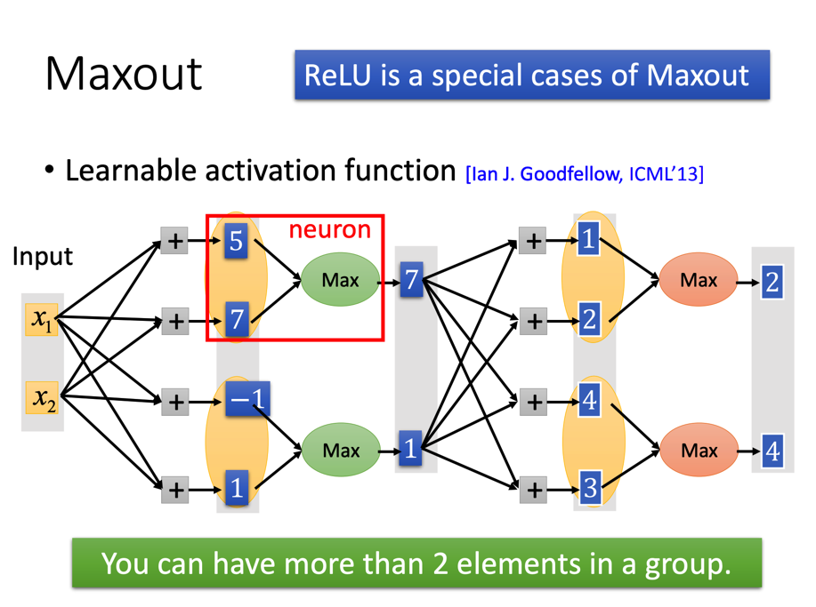
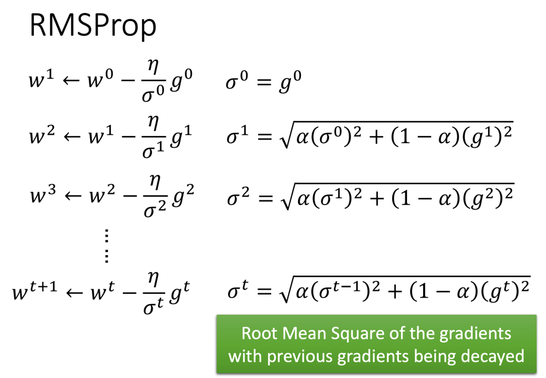
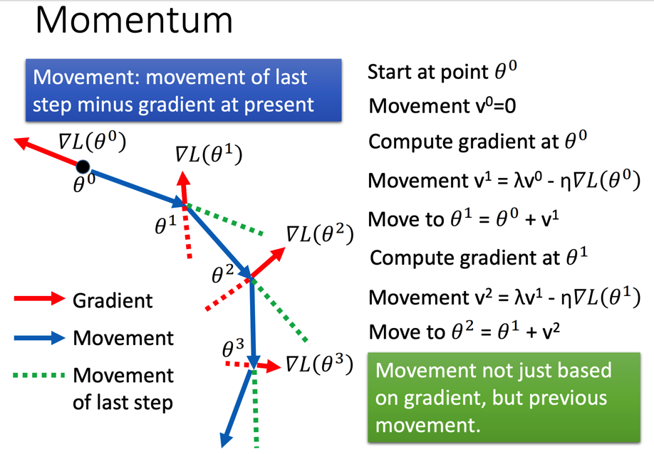
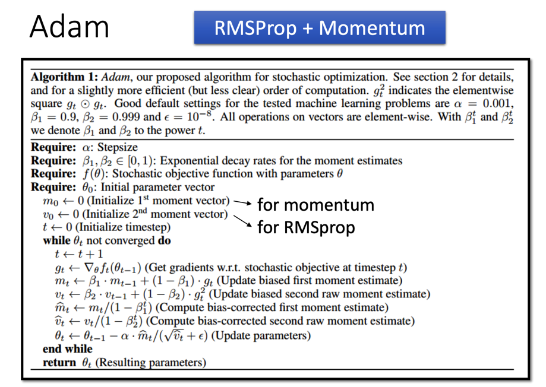
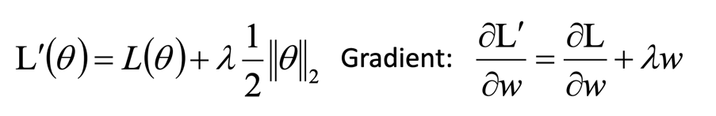
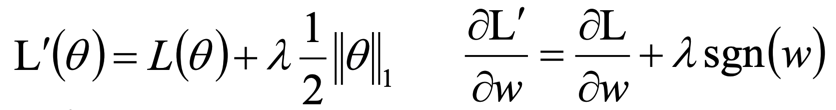

# Tips for Deep Learning

这里给出的是修正Deep Learning的一些方法。

主要思路如下图所示：

## New activation function

如果使用sigmoid函数作为激活函数的话，这个函数对于过大或过小的值会进行削弱，这使得如果使用多层神经网络的话，梯度的反向传播也会跟着逐级减弱，这使得最终靠近输入层的参数没有得到足够的训练，从而使得多层神经网络的效果比单层神经网络效果还差（这种差并不属于过拟合，因为其本身连Training Data都没很好拟合）。这就是**梯度消失**

解决思路除了减少神经网络层数以外，还有一个思路就是换一个不收敛的激活函数

### ReLU

ReLU的思想是线性并且只砍掉负值。于是其函数就是简单的分段函数：

ReLU相对sigmoid函数的好处有：

+ 计算更快（不用算exp和ln，导数也只有0和1两种，简单粗暴）
+ 生物学理论基础（跟神经元的激活方式更相似）
+ 当无限个sigmoid函数叠在一起之后，其结果就趋近于一个ReLU函数
+ 避免梯度消失

沿着这个思路，ReLU也有一些变种：

### Maxout

Maxout的核心思想是，对线性函数计算结果分组，然后每组取其最大值作为输出。

ReLU本质上就是Maxout的特例。

由于Max函数无法求导，所以在训练的时候，可以将当前轮次的非Max神经元视为不存在：

## Adapted Learning Rate

更改学习率的方式之前提到过Adagrad，但其实有比这个更高阶的做法

### RMSProp

其可调参数的取值范围在0到1之间，数值越大表示越信任之前的梯度。

### Momentum

为了减少梯度下降陷入局部最小值的几率，引入现实物理中的惯性概念。在计算下一步要走的向量之后，让这个向量加上**上一次走的向量**（的倍数，乘上的倍数越大惯性越大）。这样即使梯度下降陷入局部最小值也有可能会因为惯性冲出局部最小。

但缺点也显而易见：这会带来更多的迭代次数。

### Adam

Adam本质上就是RMSProp+Momentum：

其中m就是梯度+惯性之后的最终方向，v就是RMSProp里面要除的那堆东西（的平方）。

有几点要注意一下：

+ while里面的第5行和第6行，这两个数它除了一个值（说是做bias-corrected）。这个点在RMSProp和Momentum里面都是没有的。
  + 为什么要除还得找时间看看论文
+ while里面的第7行，为了避免v等于0，需要加一个eps

## Early Stopping

顾名思义，就是早点停止训练。

当你发现Testing Error开始反弹的时候，就需要掐掉训练了。

## Regularization

正则化有两种：L2和L1

### L2 Regularization

L2的参数修正使用二范数，补充该正则化项之和的Loss和Gradient如下：

### L1 Regularization

相对于L2而言，L1采用一范数，补充后的Loss和Gradient如下：

其中当w大于0时sgn(w)为1，小于0时sgn(w)为-1。

相对于L2而言，L1得到的特征会更为稀疏（会有一些特征参数直接被砍到趋近于0，也会有一些特征基本不砍）。

一般而言L1正则化更适合用于特征选择。

## Dropout

核心思想简单粗暴：在每一轮训练的时候随机砍掉部分神经元（设取样率为p，例如说砍掉一半的话p就等于0.5）。

> 不要砍输入层，也不要砍输出层

然后在最后用于计算结果的时候最终结果需要除以p才是预测值。

Dropout本质上也是一种多个模型之间的ensemble，只是这个多模型被整合到一个神经网络里。