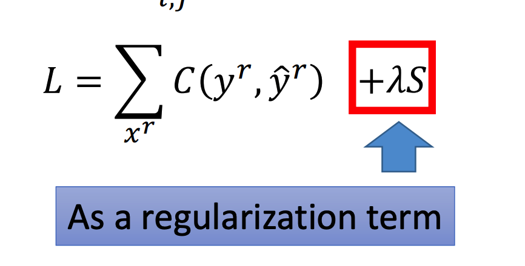

# Semi-Supervised Learning

Semi-Supervised Learning（半监督学习）是一种同时利用有标注数据和无标注数据的学习方式。

Semi-Supervised Learning分为两种：

+ Transductive Learning：利用了testing data做半监督学习
  + 将testing data也当做未标记训练数据来训练，最终计算Testing Error的时候用的数据就是这些已经见过的数据
+ Inductive Learning：没有利用testing data做半监督学习
  + 这种情况下利用的是另外一组没标记的数据做半监督了，只是最终计算Testing Error的时候用的是没见过的数据

> 此处省略生成模型的半监督学习

## Low-density Separation

Low-density Separation（低密度分离）用于分类问题中，核心思想是在数据密度较低的地方画分类的线。

其认为无标记数据跑模型之后得到的答案越肯定属于某个分类越好：

基于这个假设，这种方法会将确信度高的未标注数据改为已标注数据，再扔进模型中训练。

### 计算确信度

一般通过计算结果向量的熵来反映确信度：

> 上面的5表示向量的维度是5

熵约小表示确信度越高，当熵为0时表示完全确定

> 前提是向量值的和为1
>
> 不然出现两个为1其余为0的向量，计算熵之后也会为0

可以将熵的计算融入Loss中：

## Smoothness Assumption

Smoothness Assumption（平滑性假设）的核心思想是，两个分类一致的数据，其中间肯定会有很多过渡数据。而两个分类不同的数据没有这种特征。

其一共有两种实现方式：

### Cluster

将数据（包括非标注数据）做一个聚类，然后根据已标注的数据所在的簇对未标注数据进行标注

### Graph-Base Approach

基于图的方法主要分两步：

+ 对点建边
  + 可以是对最近的几个邻居建边，也可以是对距离在一定范围内的点建边
+ 于是会形成若干个连通图，在一个连通图上的数据就可以看做是一类

假设我们已经有一个带权值的图，现在定义平滑度S如下：

这个式子里面未标记数据的y值就是需要训练得到的了。

然后将S加进Loss里：

