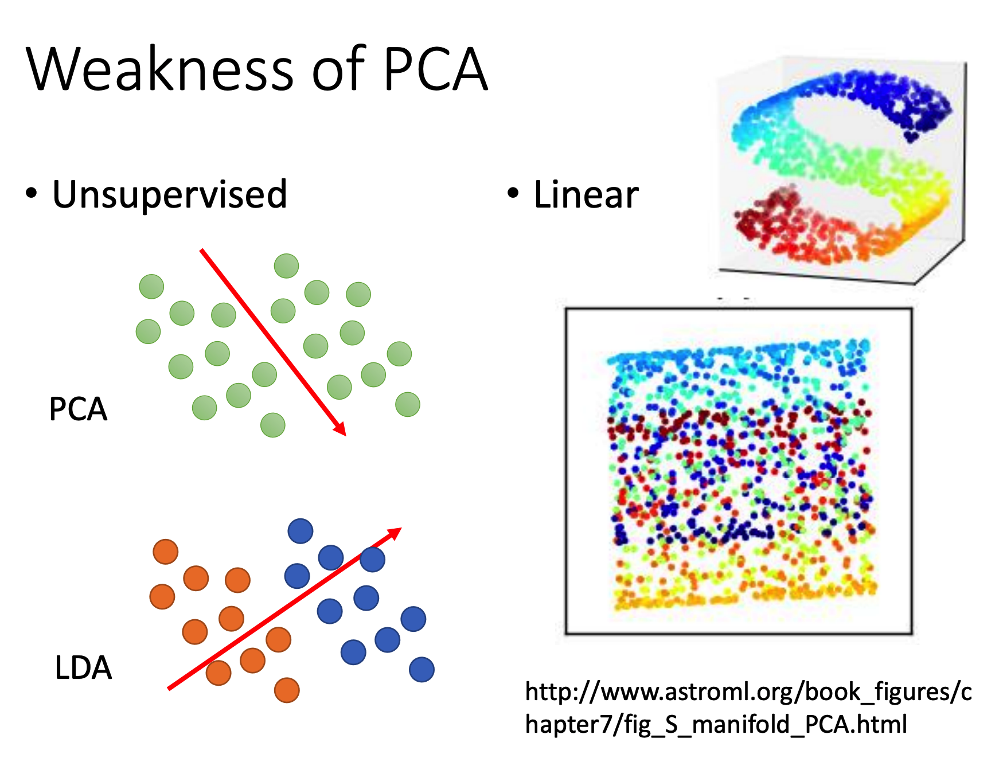

# Unsupervised Learning

本节主要讲无监督学习，包括聚类和降维。

## Clustering

聚类的目标是将所有没有标记的数据进行分类。

常用的算法是K-means和HAC

### K-means

K-means的步骤很简单：

+ 随机选定k个数据作为初始值，k表示簇的数量，选定的初始值表示簇中心
+ 对所有的数据计算其与这k个簇中心的距离，取距离最近的簇中心对应的簇作为该点的所在簇
+ 对每个簇重新计算簇中心，新的簇中心是当前簇的所有点的坐标平均值
+ 重复上面两个动作直到收敛

### HAC

HAC（Hierarchical Agglomerative Clustering）是一种基于树的分类。

其步骤如下：

+ 选取距离最近的两个点
+ 创建一个新的点，这个点的两个儿子就是上面选取的两个点，点的值就是其平均值
+ 将这两个点从待选取的点中去掉，并将新的点放进去
+ 重复上述动作直至整棵树创建完毕

建树的过程类似哈夫曼树。

建完这棵树之后就可以根据想划分的类数量，对树进行切边。

HAC相比K-means的好处是可以先不需要急着假定k的值，先把树建了再看看k要取多少比较合适

## Dimension Reduction

这里只讲常用的一种线性降维方法：PCA

PCA的目标是将通过给数据矩阵x乘上一个矩阵W，使其结果的维数下降

而PCA的过程本质上就是在求解最合适的矩阵W

> 由于自己数学功底不足，这里省略PCA的运作过程和原理，之后看西瓜书再整理
>
> 暂时停留在知道有这个东西就行

当然降维这件事情也可以搞个神经网络去整，输入和输出相同，中间层就是目标降维数，然后学习就行了。

这个神经网络就叫做Autoencoder。

### PCA的缺陷

+ 无监督：纯无监督的降维方法只考虑了点与点之间的关系，而忽视标记的作用，最终导致降维效果不好（如下图左）
  + LDA可以利用到标记信息进行降维
+ 线性：PCA是一个线性降维方法，它无法做到【将曲面平铺】这种事情（如下图右）

