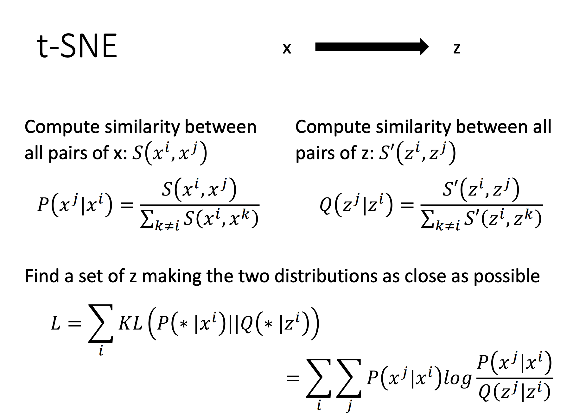
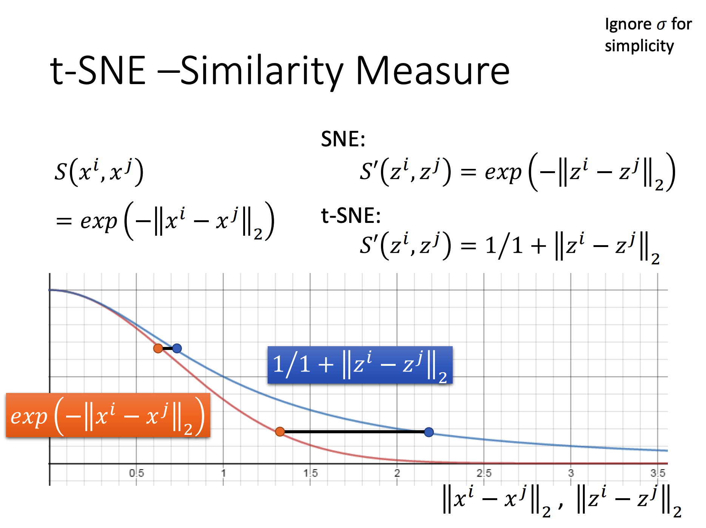

# Neighbor Embedding

这是另一种降维的方法。核心思想是利用向量的近邻关系进行降维。这样就可以避开线性降维的缺点。

笔记里只记录t-SNE。

## t-SNE

t-SNE的思想是，降维前后数据的Similarity要一致，也就是在不破坏邻居关系的情况下降维。

具体的说就是，降维前后Similarity的概率分布要保持一致。

更加具体的说就是，降维前后Similarity的概率分布的KL散度要尽可能的低。

于是只需要定好目标维数，上面的目标就是Loss，于是就可以跑Gradient Descent了。

### Similarity的计算

在t-SNE中，降维前后的Similarity的计算式子略有不同

### 用途

t-SNE的计算过程会比较慢，故一般不直接使用该算法降维。

一般会使用PCA将数据维数降为50维，再用t-SNE将数据降至二维或三维。

t-SNE的降维一般用于数据可视化。