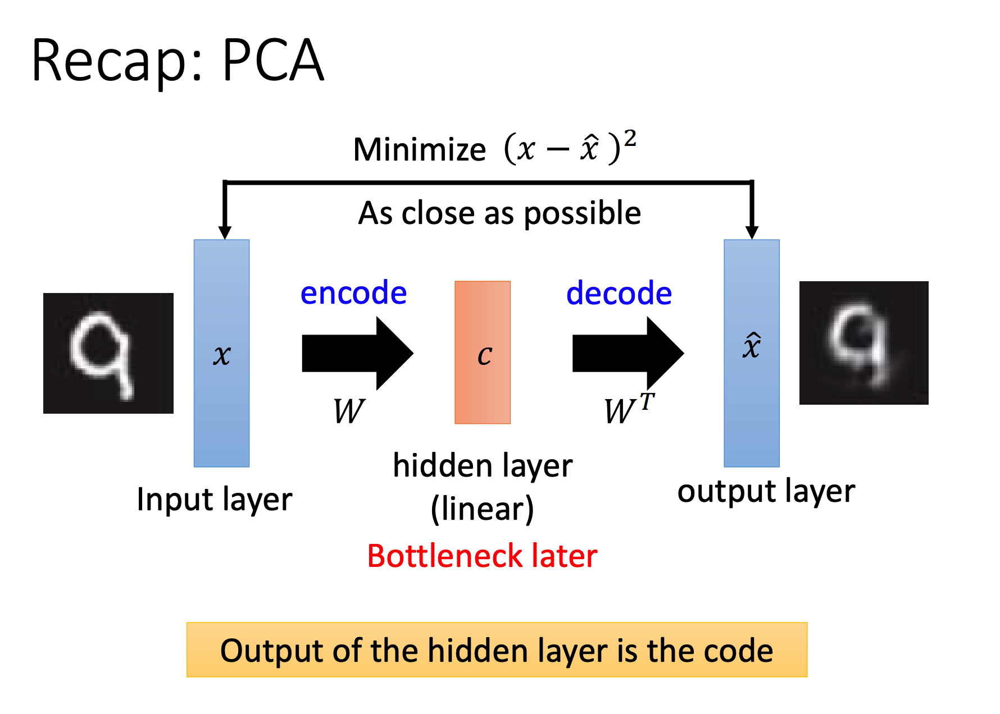
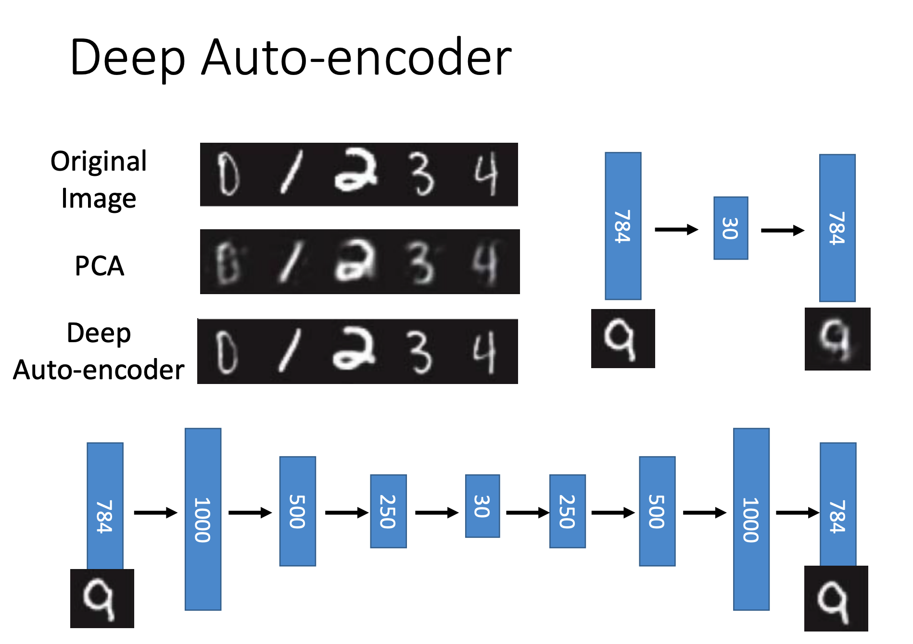

# Deep Auto-Encoder

之前记PCA的时候提到过Auto-Encoder，这里做的是其延伸。

## Auto-Encoder

本质上就是目标=输入的三层神经网络，数据落在隐藏层的值即为降维后的向量。

既然使用到神经网络了，那它就可以是Deep的。

并且事实上不需要让bottleneck layer到output layer的参数等于input layer到bottleneck layer的参数的转置（如果做到这个并且是单隐藏层的话那其本质就是在干PCA的事情）。

从效果上看，Deep Auto-Encoder的效果会比PCA好：

## De-noise Auto-Encoder

核心思想是，让Auto-Encoder在输入数据有噪音的情况下，也能获得很好的还原。

要做到这个效果的话加一个Noise层就行了：

## Text Retrieval

Auto-Encoder的一个应用是文章检索。

大致思路是：

+ 将每篇文章都变成词袋向量（Bag-of-Words）
  + 也就是一个长度为V（V为总词汇类别数），每一维记录该单词出现的次数
+ 将词袋向量用Auto-Encoder压缩成低维向量
+ 输入目标词汇，将词汇转化为词袋向量跑一遍训练得到的Auto-Encoder，得到向量
+ 用这个向量找与其内积最小的文章向量，即为结果

> 向量间相似度一般使用内积计算，也就是对应维度相乘然后相加

图片相似搜索之类的也可以用类似思路。

## Auto-Encoder for CNN

CNN也可以用来实现Auto-Encoder：

### Unpooling

Pooling的本质是取样（一般取最大值），Unpooling的就是将取样展开。

有两种实现方式：

1. Pooling的时候记录最大值所在位置，Unpooling的时候就能将最大值填回原来的地方，其他位置填0
2. 等比放大

> 下图演示的是方法一的效果

### Deconvolution

本质上还是算卷积，所以加个卷积层就行了：

## Pre-Training

Auto-Encoder可以用来给神经网络做预训练。

在训练之前用数据将每个隐藏层的参数都先用Auto-Encoder训练出来，作为之后训练的初始化参数：

## Generation

Auto-Encoder也可以用来生成数据。

以MNIST为例，在训练得到Auto-Encoder之后我们可以使用随机的向量（或者列出一排连续向量）让其进行Decode生成图像：

