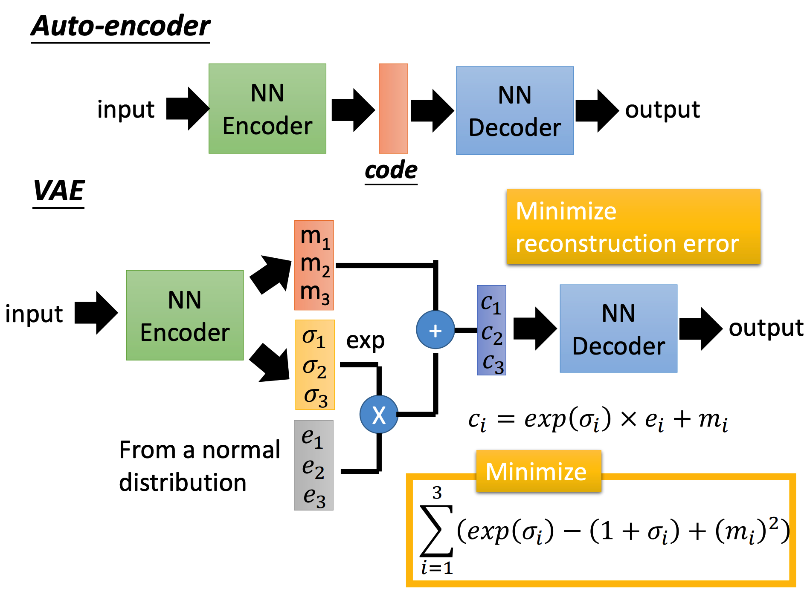

# Generation

生成模型的主要任务是构建一个能够生成想要的数据的模型。这些数据可以是图片、文字等。

这里主要讲两个模型，而GAN是下一节才会讲到的。

## PixelRNN

这是一种用于生成图像的模型。其核心思想是：

+ 将图片看做是一串像素
+ 构建一个RNN，可以根据当前所输入的像素来预测下一个像素
+ 使用已有图片训练这个RNN
+ 给出某张图片的上半部分，让这个RNN自己生成下半部分（生成步骤）
  + 当然也可以用其他方式生成

> 不知道RNN的话可以先看第21节

一个优化的Trick是，对于每个像素而言，不要使用RGB，而是使用采样颜色的one-hot。

如果使用RGB的话最终生成的图片会是灰蒙蒙的。

## VAE

事实上Auto-Encoder就可以干Generation的活了。VAE只是对Auto-Encoder进行一个改良：

