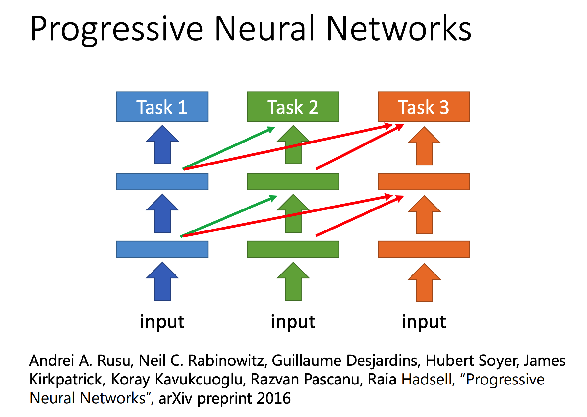

# Transfer Learning

Transfer Learning（迁移学习）是一种让针对某个任务训练的模型可以处理另一个任务的学习方式。

在Transfer Learning中，假设有两份数据，一份是原任务的数据（Source Data），一份是目标任务的数据（Target Data）。

其根据数据有无Label可以分为四大类，不同类Transfer Learning有不同：

这里只讲了Source Data有Label的情况下的两种类型的Transfer Learning，并给出4个不同的方法

## Fine-tuning

Fine-tuning用于Source Data和Target Data都有Label的情况，且一般Target Data很少但Source Data很多。

其思路很简单：

+ 先用Source Data跑一个模型
+ 将这个模型作为Target Data的预训练模型，去跑Target Data

显然这么做很容易让模型在Target Data上Overfitting，所以需要对这个方法改良一下。

### Conservative Training

其核心思想是在Target Data训练的时候加一个计算原模型与最终模型的差作为一个惩罚项。

目标可以是以下两者之一：

+ 让模型输出相近
+ 让模型参数相近

这个过程比较类似正则化

### Layer Transfer

其核心思想是，不全部迁移模型，而是迁移模型中的部分层，然后fix住这些迁移过来的层的参数，只训练新生成的层的参数：

迁移哪些层需要根据任务而定，例如：

+ 在图像处理上一般迁移前面的层
  + 因为前面的层的工作一般是从图像中抽取简单几何特征，这些特性可以用在其他图像处理任务上
+ 在语音处理上一般迁移后面的层
  + 因为后面的层是在将简单的音节处理并分类，这些特性可以用在其他语音处理任务上

> 但其实感觉不能一概而论。上述观点的基点是：
>
> + DNN前半段做的事情是将数据符号化
> + DNN后半段做的事情是将符号拼接成结果
>
> 那一个大前提就是需要观察DNN是否真的在做这个事情（中间结果可视化可以参照CNN笔记）
>
> 然后就可以根据这个特性决定迁移哪些层
>
> 例如说在语音处理上：
>
> + 如果原任务是对很多人的说话的语言识别，目标任务是对其他几个人的说话的语言识别，那就需要迁移后半层
>   + 因为最终目标同质性很强，其差别主要在源数据处理上
> + 如果原任务是对很多人的说话的语言识别，目标任务是对这些人的说话的情绪识别，那就需要迁移前半层
>   + 因为其差别主要就是在目标任务上了，前面所做的工作差别不大

## Multitask Learning

其思想类似于Layer Transfer，本质上就是让两个任务共用一些层：

### Progressive Neural Network

其核心思想是：

+ 先训练一个Task1的Model
+ Task2的Model会用到Task1的中间结果来计算，也就是相当于再加几个层用于Task1和Task2连接
+ Task3则会用到前面所有的Task的中间结果

## Domain-adversarial Training

该方法用于Target Data没有Label但Source Data有Label的情况：

它接受带Label的Source Data和不带Label的Target Data两种数据。其分为两部分组成：

+ 原始网络（绿色+蓝色）：训练目标为拟合Sourcer Data
+ 对抗网络（绿色+粉色）：训练目标为区分出Source Data和Target Data
  + 不过最终目标是不让它能区分出来，也就是做到让Source Data和Target Data在经过绿色之后能够分布相似

为了能够一块训练，绿色和粉色之间需要加一层让梯度传播是反着来的（也就是梯度取负，因为目标是要让粉色坏掉）

## Zero-shot Learning

这种方法一般用于发现新类

其核心思想是，对原数据不直接分类，而是提取出类别的特征，然后将训练目标从分类改为学习特征。

于是新的数据进来之后根据特征就可以知道：

+ 是否属于已知的类
+ 如果不是，那就是发现了新类

类别提取可以人工定义，也可以用降维来实现。