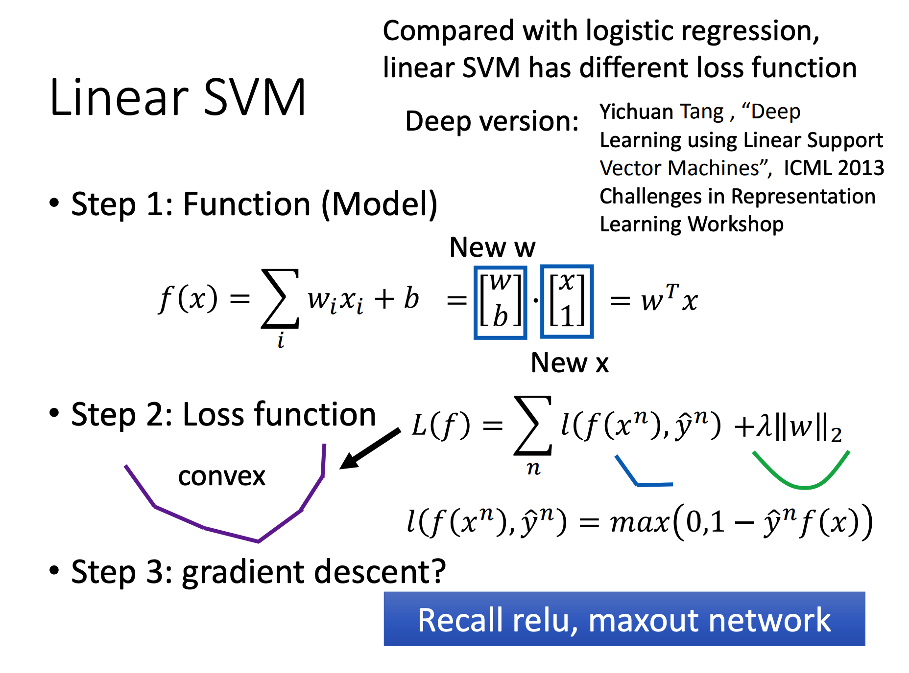
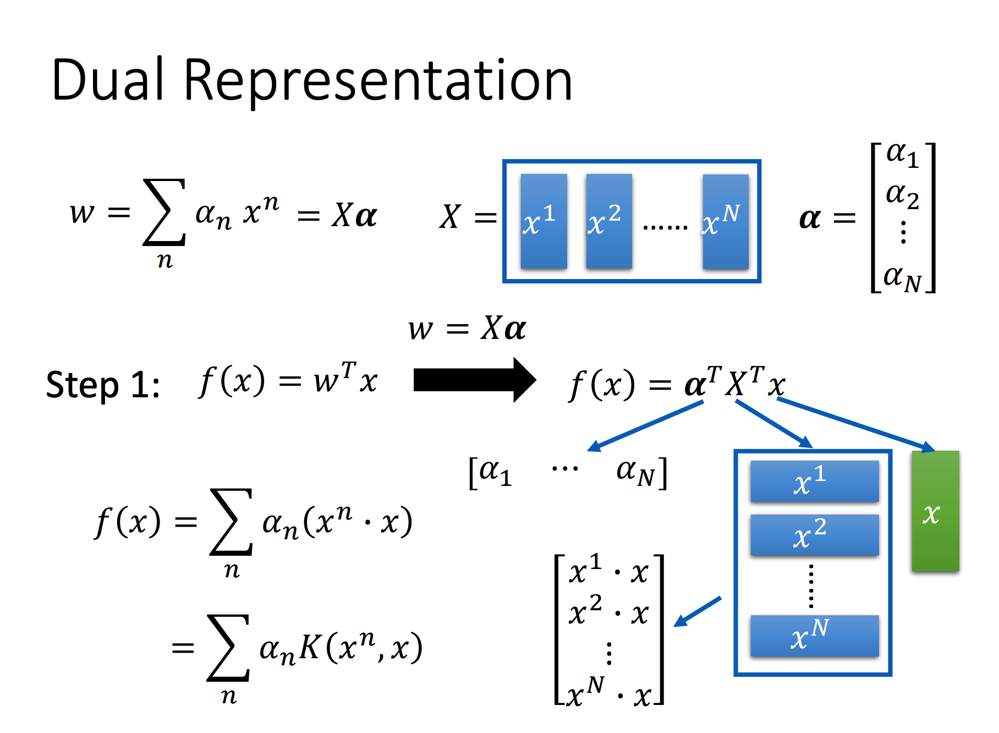
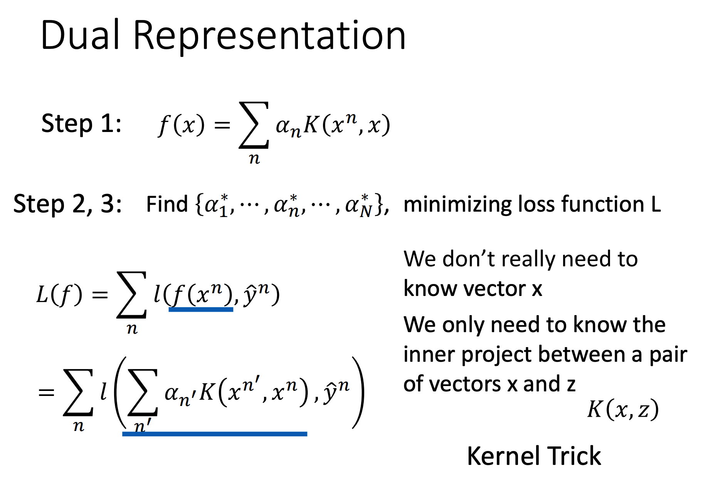

# SVM

> 打个标记，看了之后还是对SVM不理解。知道它是干什么用的，但不知道为什么这么干。
>
> 之后看统计学习方法再去系统学一遍原理。

SVM（Supported Vector Machine）常用于分类问题，目标是创建一个超平面用于最好地分割不同类的数据。

其适用于分类问题。

## Linear SVM

其相比Logistics Regression而言只是换了一个Loss Function而已：

其可以用Gradient descent，也可以直接求解。

## Kernal Trick

我们假设，那就可以将函数按如下方式改写：

注意到被定义为，这个就是Kernel Function。

然后做Gradient Descent：

可以发现，如果定义成这种形式，我们并不需要关系x的具体构造，只需要定义Kernel Function就可以求SVM了。

常用的Kernel Function有如下几种：

+ 
+ 
+ 

Kernel Function会影响到SVM的分割函数的结构，令其可以不Linear。

