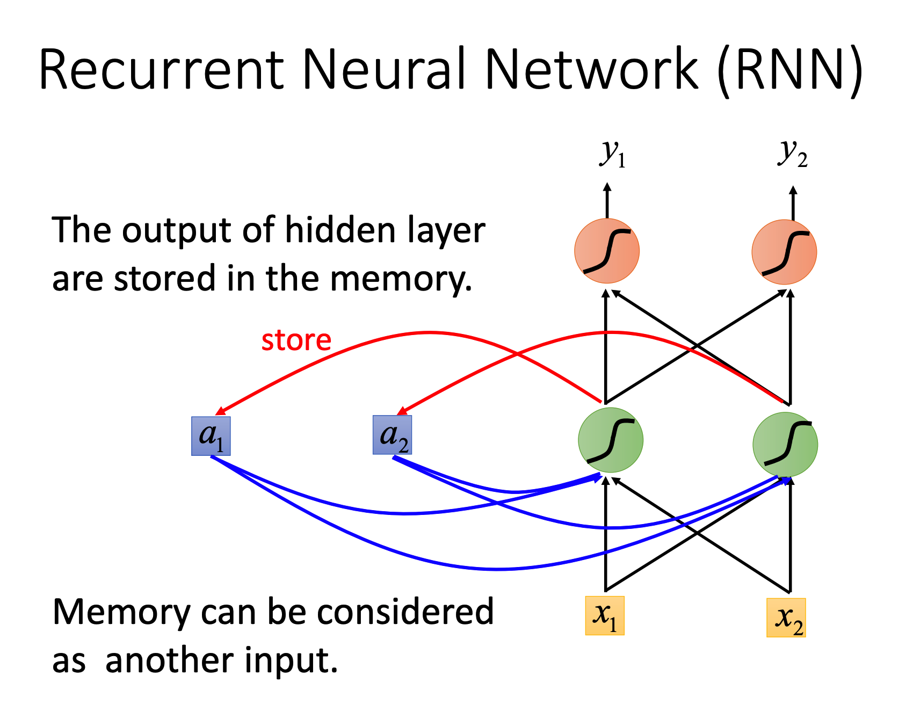
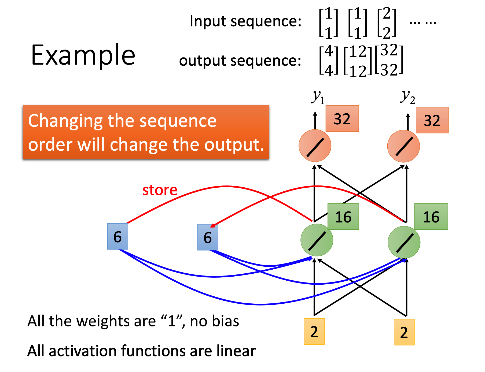
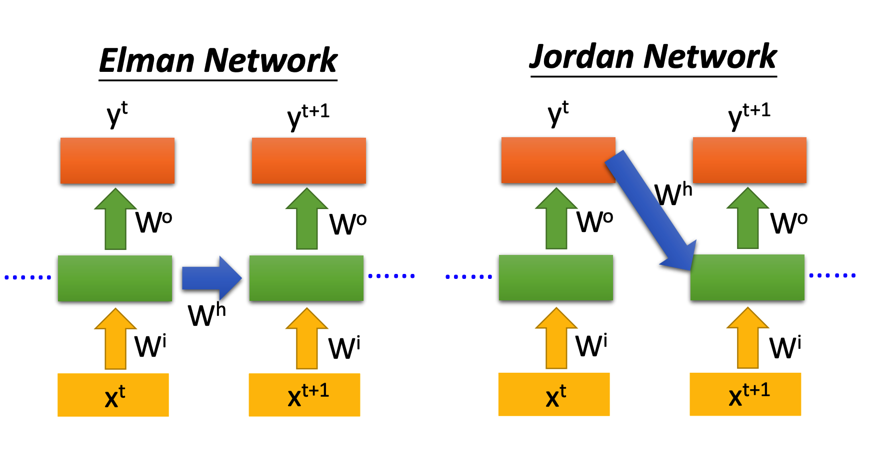
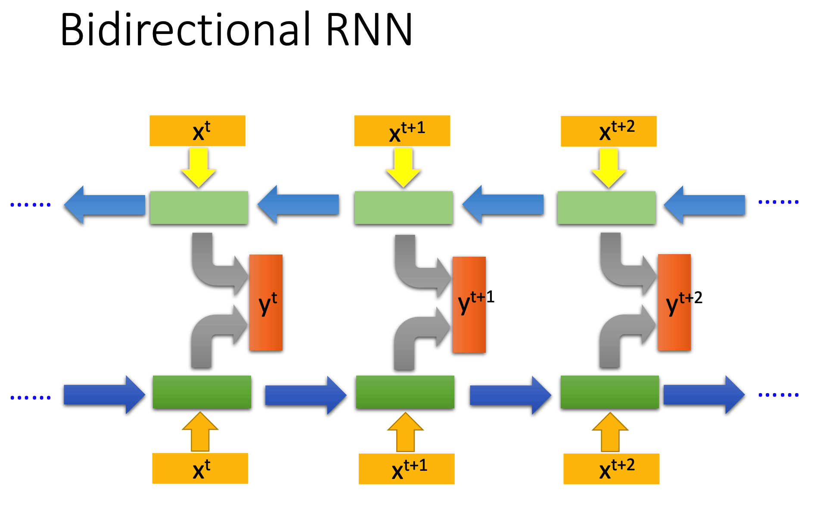
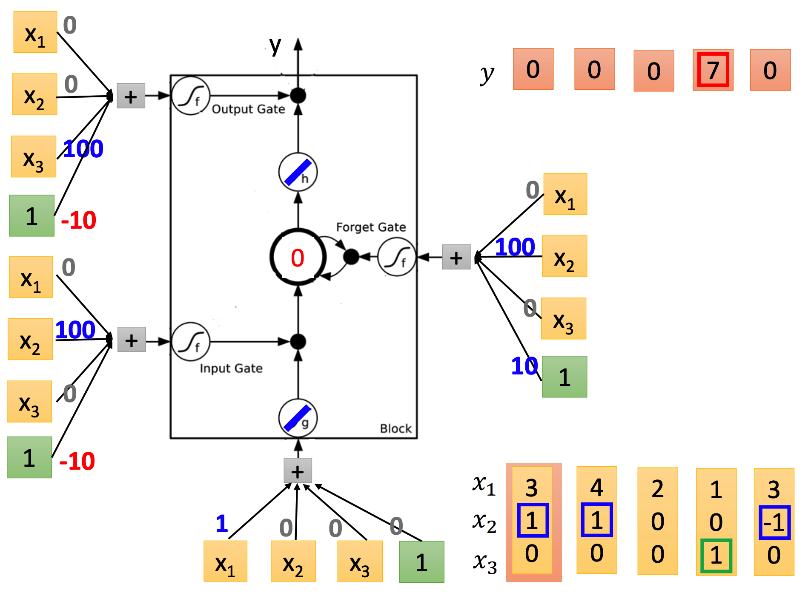
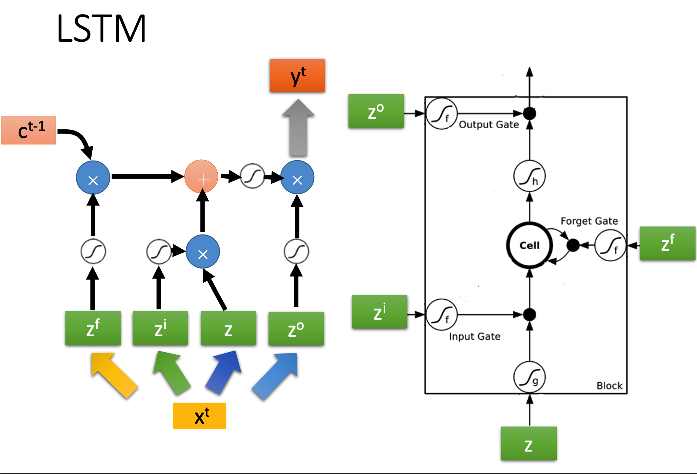
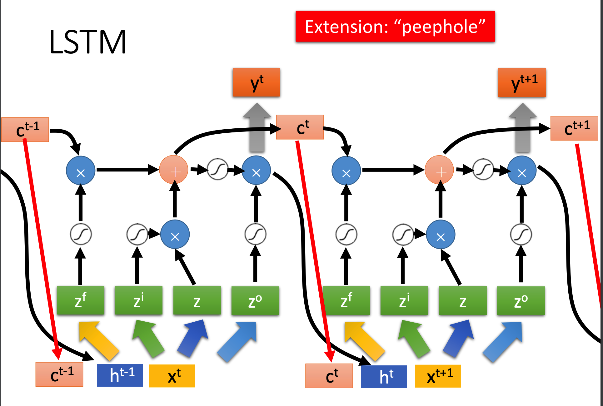

# RNN

Recurrent Neural Network，简称RNN。核心思想是：

+ 认为数据是有顺序并且受到顺序影响的
  + 典型的例子是分词后的句子，每个单词的意义都跟其上下文有关。所以显然单靠单个单词无法准确得知其义
+ 传统的Neural Network无法学习到顺序信息
+ 引入记忆单元（Memory Cell），记录上一个输入经过NN后的值，用于下一个输入的计算
  + 这样每个输入经过NN跑出来的值都会受到之前的输入的影响

在RNN的训练中，将每个数据（对标句子）看做是由多个输入（对标单词）组成。

+ 输入跟输入之间有顺序关系，利用记忆单元进行实现
+ 数据跟数据之间没有这种关系。所以上一个数据跑RNN之后得到的记忆单元应该不能作用于下一个数据

## SimpleRNN

最简单的RNN实现就是，对于每个神经元而言，都附带一个记忆单元。

这个单元用来存储上一次从这个神经元中输出的值，用于加和到下一个输入值中：

下面是一个最简单的例子，下图是一个已经训练好的RNN，图中所有的神经元都是y=x的线性函数，所有的边权值都是1。

显然的，同等规模的网络，RNN的参数数量会是DNN的两倍。

### Elman Network & Jordan Network

上面讲的RNN被称为Elman Network。还有一种实现方式叫做Jordan Network。

区别在于Jordan使用RNN最终输出存到记忆单元中，而Elman使用单个神经元的输出：

> 据说Jordan会比Elman的效果要好，因为最终输出是有意义的，而中间输出是无意义的
>
> 但如果这是一个多层RNN的话，Jordan难道不会浪费很多可记忆的值？以及为何不将两者组合起来？

### Bidirectional RNN

双向RNN的核心思想是**不漏掉下文数据**，简单地讲就是拿两个RNN，一个将数据从头读到尾，另一个将数据从尾读到头，然后将两个RNN的结果作为输入得到最终结果：

## LSTM

Long Short-term Memory（LSTM）是一种带记忆的神经元的设计方式。相比SimpleRNN的神经元设计方式而言，其可以保留更长期的记忆。

LSTM的神经元设计引入了Input Gate（控制外部输入）、Output Gate（控制最终结果输出）、Forget Gate（控制记忆单元遗忘）来让神经元尝试去学习更长期的记忆方式。

可以看到，三个Gate本质上也是需要学习的。

一个LSTM神经元相比普通DNN的神经元而言：

+ 多出一个记忆单元
+ 一共有5个激活函数，其中三个Gate的激活函数一般用Sigmoid
+ 四倍参数量，除了输入之外，三个Gate的结果同样需要让输入来决定

其计算过程如下：

### 完全体LSTM

上面这个是简化后的LSTM，完全体的LSTM还会将神经元的输出（h）和当前记忆单元的数值（c）参与进下一次的输入中：

> 图中没上标的z上面漏了一个激活函数，一个LSTM应该是5个激活函数

> 虽然第一眼过去就是“这他娘什么玩意”，但这已经是如今RNN的标准实现了
>
> 甚至为了区分，原先的RNN被称为SimpleRNN，而现在说RNN的话，一般就指代LSTM了

