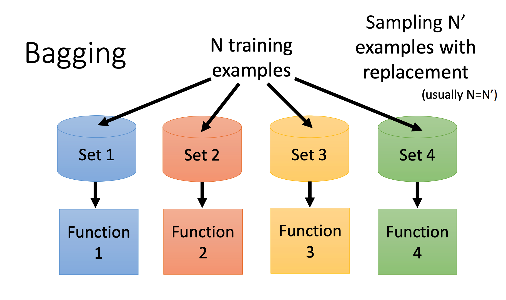
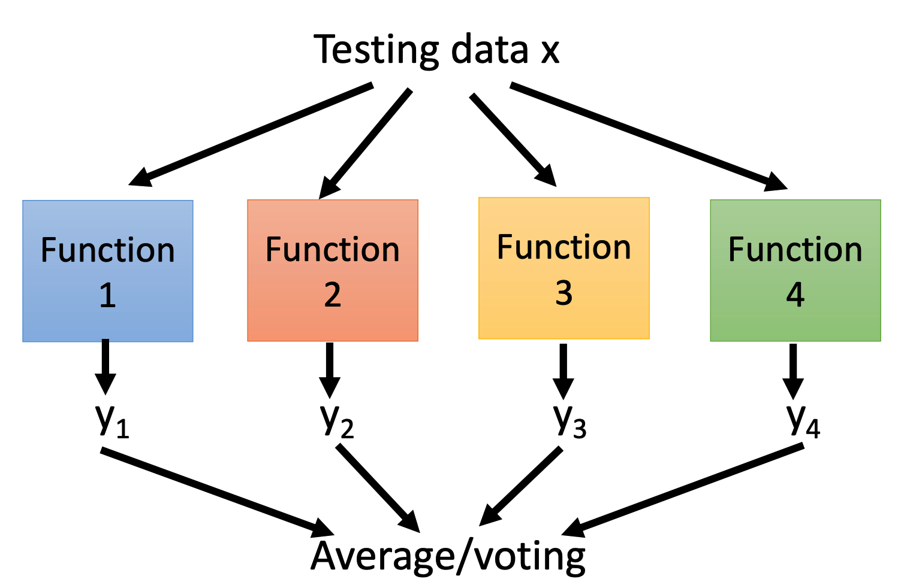
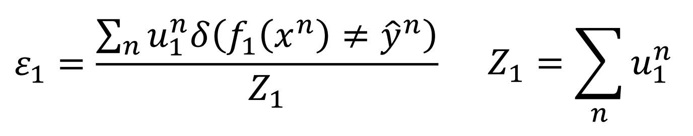
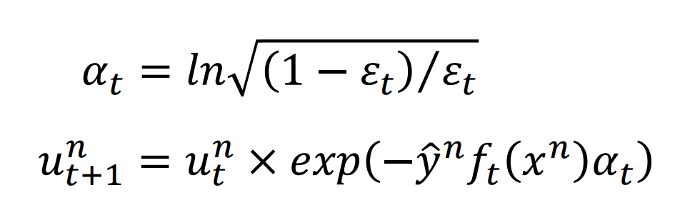
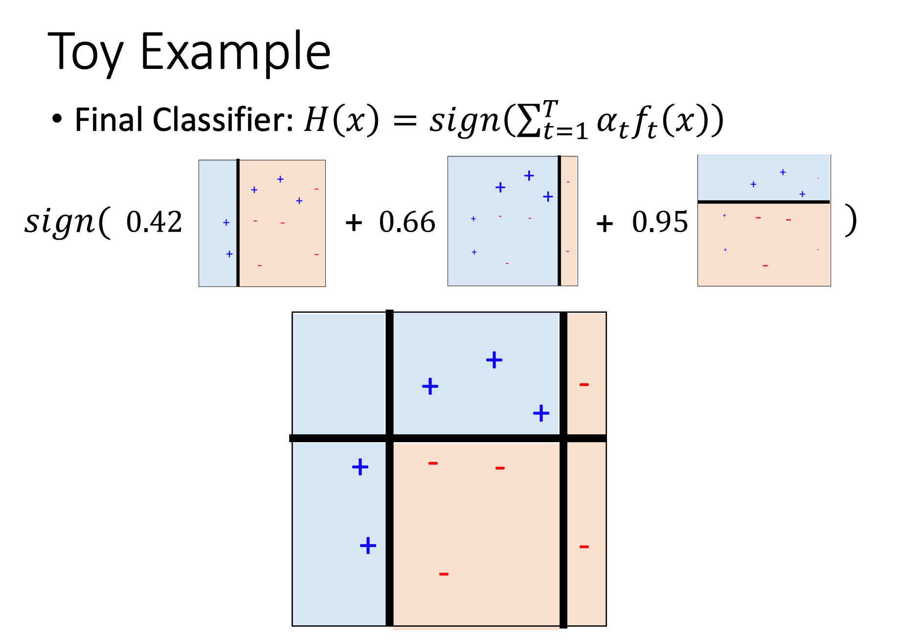
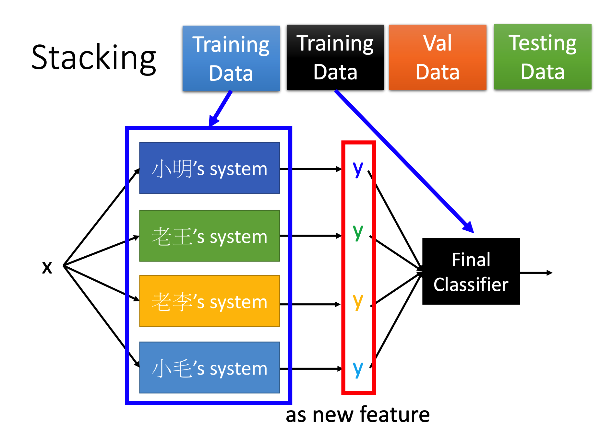

# Ensemble

Ensemble指的是对多个模型进行聚合的方法。其主要有三大类：

+ Bagging
+ Boosting
+ Stacking

## Bagging

Bagging的核心思想是：

+ 将训练集切分为多个训练集（不同训练集不需要数据完全不一致）
+ 对每个训练集分别训练一个模型
+ 对于待预测数据，先在每个模型上跑一遍，然后求Average/Voting
  + 回归问题求Average，分类问题求Voting（投票）

其适用于高Variance的模型。将多个低Bias高Variance的模型Bagging起来可以降低Variance

> 低Bias高Variance使得其每次训练出模型都会有误差，但平均起来又很靠近正解。所以Bagging能生效

比较典型的应用就是对决策树的Bagging

> 决策树本身就是一个极容易Overfitting的模型。只要树够深其可以轻松做到在Training Set让误差为0
>
> Random Forest就是对多棵决策树的Bagging，其在每次选择分叉的时候随机ban掉一些特征使得每次生成的树都不太一样（当然包括数据集分割的不同），然后做Voting

## Boosting

Boosting用于聚合多个比较弱的模型（即在Training Set上表现也很差的模型，不一定是高Bias）

其核心思想是，先训练出一个弱分类器f1，然后根据f1所预测的情况生成一个可以偏向f1预测错的数据的模型f2，依此迭代得到多个模型，预测时按权重Voting得到结果。

### Adaboost

在Adaboost中，每个数据除了x和y之外，还有一个值为权重u。

对不同模型而言，权重u是不同的。

#### 带权重数据的训练

其误差率的计算方法会变成：

以这个的最小值为训练目标即可。

#### Re-weighting

当一个模型被训练出来之后，就需要计算:

于是预测函数和示例如下所示：

### Gradient Boosting

其思想是，将模型本身当做是可以迭代的对象，然后进行梯度下降。

> 这个比较复杂，暂时还没看懂，先不做笔记了。留个tag先。

## Stacking

Stacking也用于聚合多个weak或不weak的模型。其原理是再训练一个分类器用于判断模型的权重。

另一个分类器接收其他模型的输出作为new feature当做输入来训练。

也就是说，其需要两个Training Data：

