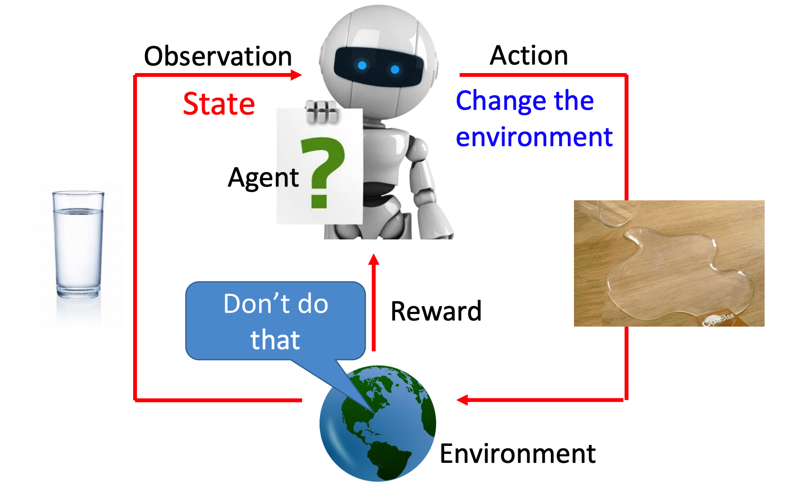
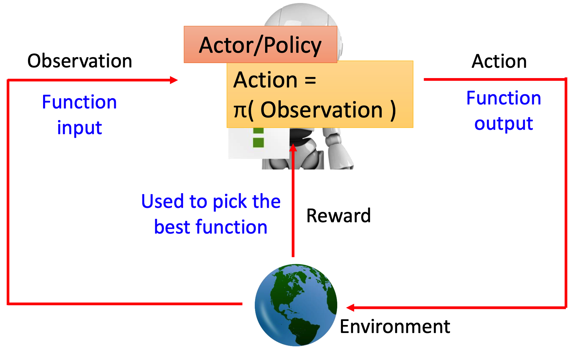
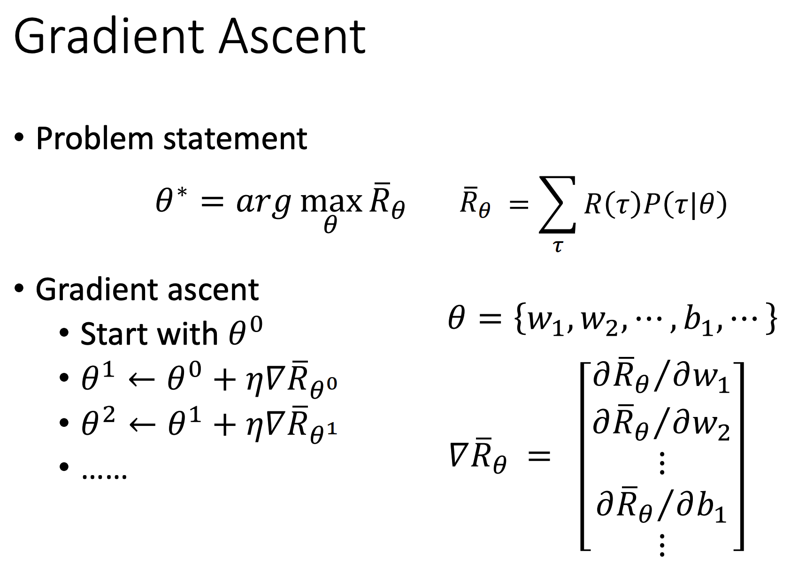

# Reinforcement Learning

> 强化学习是一个很大的课题，这里只讲了一些入门的知识

强化学习的核心思想是让机器自己从环境中学习。其主要流程如下图所示：

其主要分如下几个部分：

+ Environment：学习场景对应的环境
+ Agent：强化学习的本体，需要从Environment中学习的AI
+ Observation：Environment中的状态，Agent的输入
+ Action：Agent通过输入Observation得到的输出，表示其对状态的反映
+ Reward：Action会反馈到Environment中，而Environment会根据其效果给出Reward
  + Reward用于Agent调整自己的策略/模型参数

有一点需要注意的是，**不一定每次Action都有Reward**。

以下围棋为例，AI每走一步都不会得到Reward（可以理解为Reward=0），直到棋局结束，胜利则得到1，失败则得到-1。

> 其他方法计算Reward也可（例如按终局子差算），但本质是一样的。

## Actor

这里只会讲到其中一种比较简单的强化学习方法：Actor（部分论文也将其成为Policy）

其将Agent视为一个Function，将上面的流程图解释为下面的样子：

遵循机器学习的步骤，其学习也分为三步：

+ 构建模型
+ 定义目标
+ 训练逼近目标

### 构建模型

由于Actor的模型就是一个Function，所以其完全可以使用之前讲过的神经网络

使用Deep Model的强化学习就是深度强化学习（DRL）

Actor针对输入的Observation，产生其做每个Action的概率

> 例如学习玩游戏的AI，输入当前游戏画面，输出其各个操作的概率（例如按左键概率0.7，按右键概率0.2，按开火概率0.1）

然后再根据概率分布使用一个随机数生成器来决定最后输出的Action

> 注意不要直接输出概率最大的Action，不然很难学到低概率的情况（以及会出现类似石头剪刀布一直出石头的情况）

### 定义目标

从最开始的强化学习流程定义中，可以很清晰的知道Reward越大越好

但由于同样的模型且同样的环境下Reward不一定完全相同，故需要最大化的应该是Reward的期望值。

我们定义一次episode（游戏场景中可以理解为一局游戏之类的）包括如下动作：

+ 获得初始的Observation（s_1）
+ 根据s_1获得Action（a_1）
+ 由于a_1得到Reward（r_1）
+ 获得新的Observation（s_2）
+ 根据s_2获得Action（a_2）
+ 由于a_2得到Reward（r_2）
+ 。。。
+ 由于a_T得到Reward（r_T），episode结束

据此我们可以定义一次episode包含的状态列表为：

于是就有总Reward：

我们假设在模型参数为的情况下，状态列表出现的概率为，于是就有该模型的Reward期望为：

显然状态列表有无穷多种，我们可以直接让机器运行N次episode（理解为玩N次游戏），得到N个。于是我们就可以近似将每个出现的几率视为，于是期望可以近似计算为：

我们的目标就是让上面这个东西最大化

### 训练

在之前提到的Regression中，我们定义一个损失函数L，并用Gradient Descent令其最小化

而现在我们定义一个目标函数，但目标并不是让其最小化，而是反过来的，让其最大化

于是我们迭代的时候不再是沿Gradient减下去，而是反过来地，让其增加上去。这就是Gradient Ascent

于是我们的目标是算出，并用其做Gradient Ascent

回到目标函数的公式：，可以发现在计算梯度的时候是常数项，于是可以得到：

为了用上之前提到的近似，让上面的式子乘上和除以（相当于啥事都没做），可以得到：

进而得到：

又由于（基础求导法则，怕忘记了所以记上）：

于是有：

忽视常数项，问题转化为求

由于：

即为：

两边求log，就有：

上式只有这一项跟模型有关，故求偏导可得：

这里面就是模型输入时的输出中，对应的概率。

整理一下可以得到最终式子：

#### Add a Baseline

如果Reward只有正数的话，那么只要被随机到的局面其概率都会上升。这样对没有被随机到的局面就会有影响。

故一般会给总Reward一个偏置，使其均值尽可能为0：

