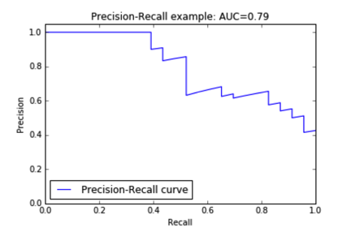
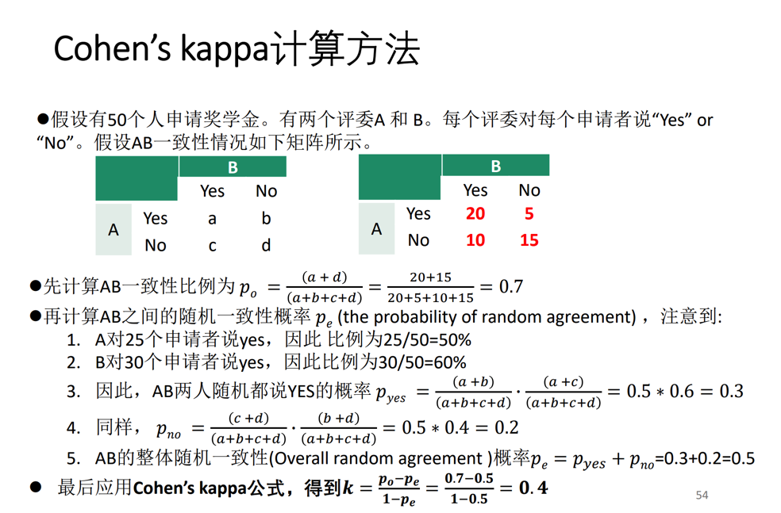
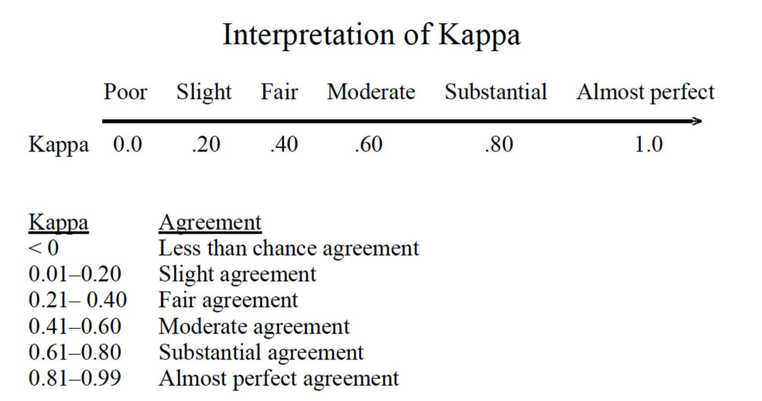

# 深度学习概述

### 网格搜索

假设模型有两个超参数a和b，分别有3种和4种不同的取值。现在的目标是找出最合适的取值使得模型效果最好。

网格搜索的本质就是暴力枚举3x4=12种（也就是所有）可能出现的超参数组合，对每种组合进行训练，比较检验误差选出最好的组合。

## 分类性能度量

这里仅讨论二分类问题

首先我们知道几个二分类常用指标：

+ 查准率：，也即在所有模型预测出是True的例子中，真正是True的比率
+ 召回率：，也即在所有真实情况下是True的例子中，被模型检测出来的比率
+ ：，综合考虑了查准率和召回率的评测指标
+ ：，越大（`>1`）则越倾向于查准率，否则（`0~1`）越倾向于召回率
+ 真阳性率：，也就是正例的召回率
+ 伪阳性率：，也就是负例的召回率

### P-R曲线

事实上对于同一个模型，查准率高了召回率自然就会低。所以我们需要通过绘制P-R曲线来了解其综合性能如何

曲线的横轴是P，纵轴是R（反过来也行），对同个模型取多个不同的PR对绘制曲线

> 取多个PR对的方法是通过设置阈值
>
> 对于模型而言其只会产出某个case是正例的概率
>
> 那么我们就可以从大到小枚举阈值，当概率高于阈值才视为正例，否则视为反例
>
> 于是对每个阈值都可以得到一个PR对，于是就能绘制图像了

P-R曲线一般如下图所示：

可以看到曲线会包裹出一块区域，这块区域的面积即为AUC，我们可以根据其面积大小来判定模型的好坏

### ROC曲线

本质上就是TPR-FPR曲线，绘制方法跟P-R曲线一样。同样地也有一个叫ROC-AUC的东西

## 一致性评价标准

有时候需要评判两个实体的一致性（例如两个特征，他们本身没有数值，只会在每条记录中有其对应的数值）

于是需要一套判定一致性的标准

可以简单理解为**两个数列是否相关**

### 皮尔森相关系数法

公式为：

其中，是分布X的方差，是分布X和Y的协方差，其计算公式为：

其中是分布X的期望

皮尔森相关系数的取值为-1到1之间，其中：

+ -1表示完全负相关
+ 0表示完全无关
+ 1表示完全正相关

### Cohen's kappa

Cohen's kappa常用于衡量离散分布的一致性

计算方法如下：

其评判标准如下：

多个分布计算一致性则会用到Fleiss's kappa，但使用场景较少，暂时不做笔记。