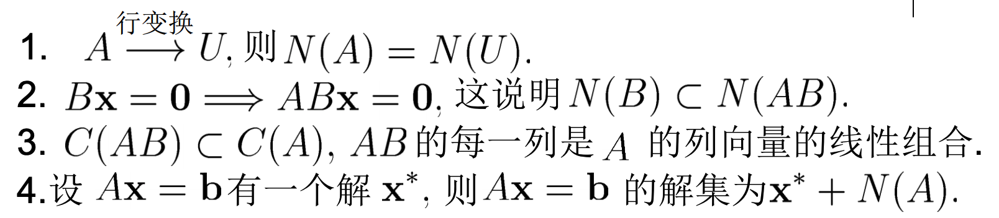

# 第七讲 向量空间

向量空间为一个向量集合，集合内的所有向量的线性组合仍旧在集合内（也就是集合封闭）。

例如三维空间中某个平面中所有的点构成一个向量空间。

我们考虑方程，当其有超过一个解的时候，其有无穷多个解。

显然地，如果我们得到上面方程的其中一个解以及方程的解空间，

则方程的解空间可以表示为

## 向量空间和子空间

一个向量空间中仍旧会有其一个子集，该子集计算封闭，则这个子集构成该向量空间的子空间。

## 列空间和零空间

+ 列空间：构成矩阵A的向量的线性组合构成矩阵A的列空间，记为
+ 零空间：方程的解空间

## 阶梯型矩阵

我们将矩阵A通过行变换得到上三角矩阵U，这个矩阵被称为阶梯型矩阵。

该矩阵的每行第一个非零元素为主元，主元所在的列为主列。

其他列则为自由列，可以由主列们线性组合得到。

