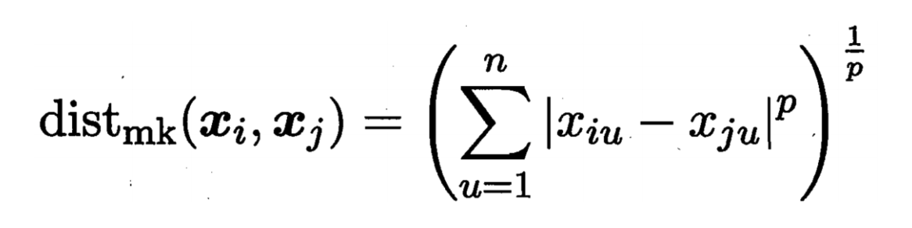
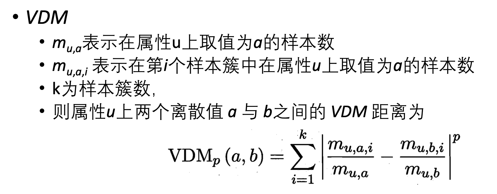
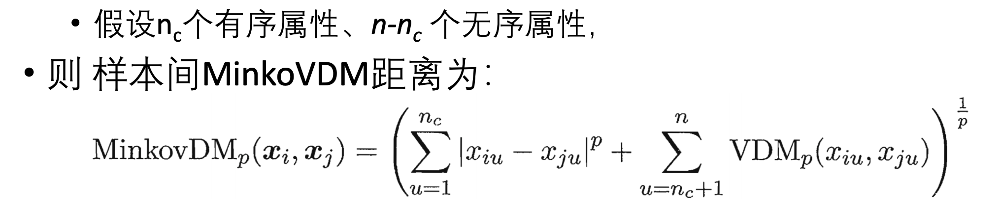
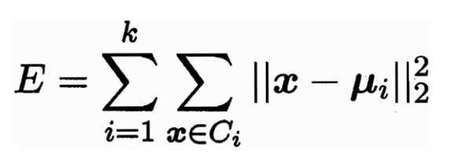

# 聚类

聚类是一种无监督学习方法，用于对数据进行自动类别划分。

本质就是成簇。

## 性能度量

好的聚类应该满足如下条件：

+ 簇内相似度高
+ 簇间相似度低

具体有两种度量方法

### 外部指标：计数法

假设我们有一个已经分类好的数据集，然后使用AI训练出另一种分类结果。

那么所谓外部指标就是借助计数来衡量两个分类的相似性。

假设有m个数据点，于是一共有`m(m-1)/2`个点对。将点对分为四类：

+ a类：两个点在两种分类方式都属于同一类
+ b类：两个点在人工分类上属于同一类，在训练分类上属于不同类
+ c类：两个点在人工分类上属于不同类，在训练分类上属于同一类
+ d类：两个点在两种分类上都属于不同类

于是就有三种指标（均为越大越好）：

+ Jaccard系数：
+ FM指数：
+ Rand指数：

### 内部指标：距离法

首先计算四个量：

+ 簇内所有点对距离的平均值：
+ 簇内所有点对距离的最大值（簇直径）：
+ 簇间所有点对距离的最小值：
+ 两个簇的中心点的距离：

于是就有两种计算指标：

+ DB指标（越小越好）：
+ Dunn指标（越大越好）：

#### 距离定义条件

距离的定义可以有很多种不同的方式，但需要满足如下四个条件：

+ 非负性：距离值大于等于0
+ 同一性：当两点距离为0时，两点向量相等
+ 对称性：x到y的距离等于y到x的距离
+ 直递性：x到y的距离加y到z的距离必须大于等于x到z的距离

#### 距离计算

对于具有数值的点，可以使用Minkowski距离计算：

当p=2时为欧几里得距离，当p=1时为曼哈顿距离

#### 距离计算（无序属性）

如果特征值为无序的（例如说黄色、男性等），则其对于的向量没有数值，此时需要换种方式计算距离。

首先计算VDM：

那么对于含有无序属性的特征的距离计算就可以这么做：

## 聚类算法

### 原型聚类

原型聚类算法假设聚类结构可以通过一组原型来表示。

算法先对原型初始化，然后迭代求解。

#### k-means

k-means的核心思想是最小化簇内各点跟簇中心的平方误差：

其步骤是：

+ 先随机选几个点（点的个数由自己决定，最终决定类别的数量）作为初始簇中心
+ 枚举每个点，对所有的簇中心计算平方误差，选取距离最小的簇中心作为其分类
+ 对每个类重新计算簇中心，得到新的簇中心
+ 重复直至簇中心收敛

#### 学习向量量化

学习向量量化的思想是，输入带有类别标签的数据，学习得到每个分类的原型向量。

> 所谓原型向量即为能代表簇的点（是否是簇中心需要另外讨论）
>
> 使得之后给定任意一个点，都可以通过计算与这些点的距离并选取最近的点，从而选取其所在分类

其步骤为：

+ 先随机初始化几个向量，向量个数等于数据的类别数
+ 随机选取一个点，计算其对所有向量的距离并选取最近的向量
+ 如果该向量代表的类跟该点的分类相同，则向量向点拉近距离，否则拉远距离
+ 重复直至收敛

### 密度聚类

密度聚类的核心思想是仅聚类密集点，通过选取核心点和圈定-邻域，并通过密度传递来进行聚类。

也就是说在这种聚类方式下，离群点有可能不会被聚类。

其包含两个可调参数：和

+ -邻域：对于某个点x，与其距离小于等于的所有点的集合称为点x的-邻域
+ ：当一个点的邻域内包含大于等于个点时，该点被称为核心点

然后针对密度分布规定如下概念：

+ 密度直达：如果点a位于点b的-邻域，且点b是核心点，则点a由点b密度直达
+ 密度可达：如果点a由点b密度直达/可达，点c由点a密度直达/可达，则点c由点b密度可达
  + 密度可达具有传递性

那么密度聚类的步骤如下：

+ 随机选取一个核心点
+ 将所有由其**密度可达**的点都拿出来，当做是一个聚类
+ 重复直至没有核心点

### 层次聚类

层次聚类的思想是，对整个数据集构造一颗分类二叉树

优点就是可以建完树之后再看分几类比较妥当

一个显而易见的缺点是这颗树难以泛化

其步骤为：

+ 将所有的点看做是单独的簇
+ 选取两个最近的簇，将其聚簇（也就是建树）
+ 重复直至建完整棵树
+ 根据分类树划分想要的分类