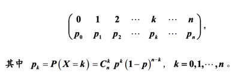
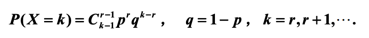
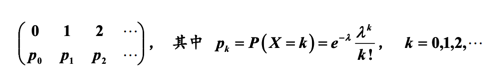
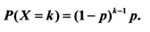
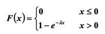
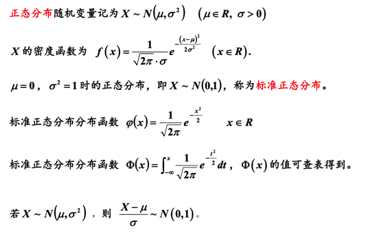

# 常用随机分布

常用随机分布包括：

+ 二项分布
+ 泊松分布
+ 几何分布
+ 指数分布
+ 正态分布

## 二项分布

首先需要知道最基础的伯努利试验。

当随机变量X有p的概率为1，1-p的概率为0时，其为一次伯努利试验。

将伯努利试验重复进行n次，则其为二项分布。此时X的分布律如下：

此二项分布记为

### 负二项分布

假设进行无数次伯努利试验，设随机变量X为第r次成功所需的次数，则有：

该分布为负二项分布，记为

## 泊松分布

给定常数<a href="https://www.codecogs.com/eqnedit.php?latex=\lambda>0" target="_blank">0" title="\lambda>0" /></a>，那么对于随机变量X，如果满足：

则其满足泊松分布，记为

当二项分布中n很大p很小的时候，当泊松分布的常数等于np时，二项分布与泊松分布接近。

## 几何分布

假设连续进行概率为p的伯努利试验，设随机变量X表示第一次试验结果为1时所做的试验次数，则其分布满足二项分布：

记为

几何分布是没有记忆性的，也即：<a href="https://www.codecogs.com/eqnedit.php?latex=P(X>s&plus;t|X>s)=P(X>t)" target="_blank">s&plus;t|X>s)=P(X>t)" title="P(X>s+t|X>s)=P(X>t)" /></a>

## 指数分布

当随机变量X的分布函数满足：

则其满足指数分布，记为

指数分布同样具有无记忆性。

## 正态分布

> 纠正，第四行的分布函数应该为密度函数

