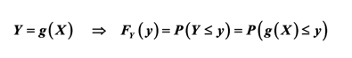
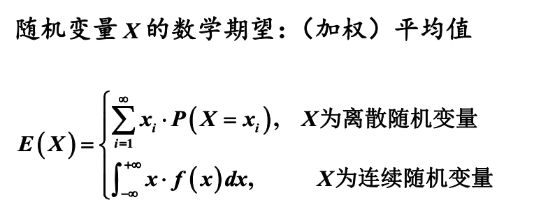
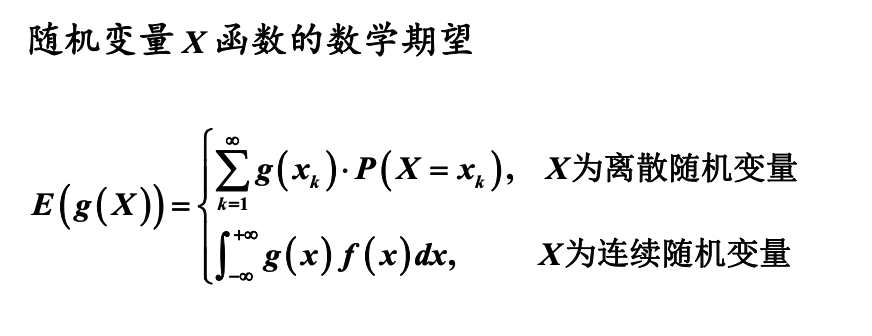
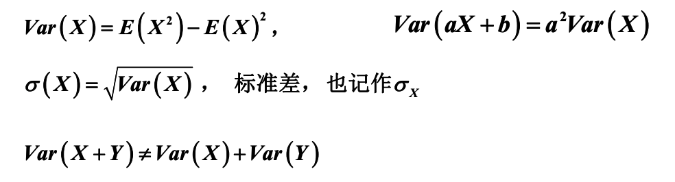
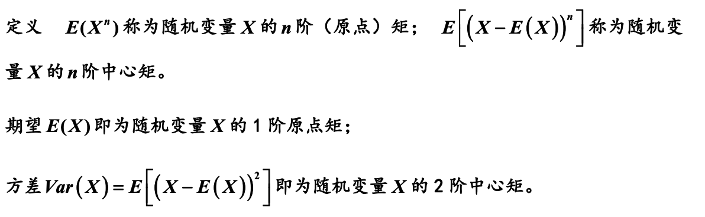

# 随机变量函数的分布及随机变量的数字特征

## 随机变量函数的分布

这里将会展示，在已知随机变量X的分布的时候，求随机变量Y=g(X)的分布

### 离散型随机变量函数的分布

对于离散型而言，只需要一个个带进去就行了：

### 连续型随机变量函数的分布

同样是带进式子里，然后将X提出来就行了：

## 随机变量的数学期望

期望满足一般的加减规则和数乘（实数乘期望函数）规则。

## 随机变量的方差

## 原点矩与中心矩

## 随机变量期望和方差的其他性质

### 期望最小二乘性质

设X为一随机变量，则当时，达到最小

### 切比雪夫不等式

对任意<a href="https://www.codecogs.com/eqnedit.php?latex=\varepsilon&space;>0" target="_blank">0" title="\varepsilon >0" /></a>，<a href="https://www.codecogs.com/eqnedit.php?latex=P(|X-E(X)|>\varepsilon)\leq&space;\frac{Var(X)}{\varepsilon^2}" target="_blank">\varepsilon)\leq&space;\frac{Var(X)}{\varepsilon^2}" title="P(|X-E(X)|>\varepsilon)\leq \frac{Var(X)}{\varepsilon^2}" /></a>

参数一般代入标准差，进而用来估算随机变量距离期望n个标准差的最小概率。